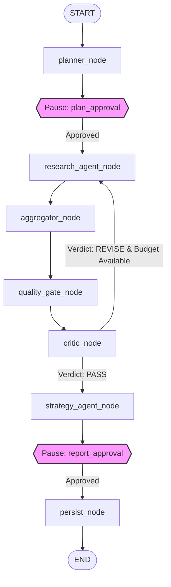

<div align="center">
  
  <h1><strong>Stratix</strong></h1>
  <h3>Autonomous Multi-Agent Market Intelligence Platform</h3>
  <p><em>Observe. Analyze. Strategize. Autonomously.</em></p>
  <p>
    <a href="https://python.org"></a>
    <a href="https://langchain-ai.github.io/langgraph/"></a>
    <a href="https://fastapi.tiangolo.com"></a>
    <a href="https://ai.google.dev"></a>
    <a href="https://www.langchain.com/langsmith"></a>
    <a href="https://www.docker.com"></a>
  </p>
</div>

---

Stratix (formerly Keylytics) is a production-grade agentic AI platform that autonomously executes multi-step market intelligence research workflows. The platform orchestrates complex research tasks—including planning, structured tool execution, data aggregation, quality gating, adversarial critique, strategy synthesis, and checkpointer persistence—through a stateful LangGraph pipeline. Designed for high reliability, it integrates human-in-the-loop (HITL) checkpoints to allow manual approval and state modification mid-execution. By combining robust database engineering with systematic LLM-as-judge evaluation, Stratix converts raw search and competitor data into validated, high-impact strategic intelligence.

---

## What Makes This Different

Stratix is built around an autonomous pipeline that uses stateful checkpointing to ensure research flows survive process restarts and run deterministically. Unlike standard chatbots or simple linear scripts, the execution state is saved to a persistent database checkpoint after every node transition, allowing long-running multi-agent tasks to run safely.

The architecture incorporates human approval gates directly into the graph execution loop. At critical boundaries, the runtime pauses execution, persists the state, and waits for a user to inspect, modify, or approve the intermediate outputs. This guarantees alignment and controls costs before proceeding to resource-intensive execution steps.

Continuous intelligence is achieved through scheduled execution and automated report diffing. The scheduler automates research tasks on a cron-like schedule, compares consecutive outputs to compute confidence and strategic shifts, and alerts operators to market changes.

Quality assurance is embedded natively into the workflow via a combined quality gate and adversarial critic node. Raw research findings must pass strict quantitative confidence and coverage thresholds, followed by an adversarial review cycle that can reject and redirect the agent flow to gather better data.

---

## Pipeline Architecture

The LangGraph StateGraph coordinates the execution of seven specialized nodes. It manages transition logic, retry budgets, and state recovery, pausing at two distinct human-in-the-loop interrupt points for approval.



---

## Core Capabilities

### 🔍 Market Intelligence Engine
* **keyword_research**: Identifies high-value search terms and calculates organic search volume metrics via Pydantic-validated I/O.
* **serp_analysis**: Audits search engine results pages to map search intent patterns and competitive listings.
* **competitor_gap**: Inspects competitor domains to highlight visibility gaps and content optimization opportunities.
* **trend_forecast**: Projects future search volume adjustments and seasonal keyword fluctuations.
* **topic_cluster**: Groups disparate terms into semantic topical structures to map content authority spaces.
* **intent_classifier**: Categorizes queries into transactional, informational, commercial, or navigational intents.

### 🤖 Autonomous Research Pipeline
* **Strategic Planning**: Formulates a detailed research plan targeting seed concepts.
* **Parallel Execution**: Dispatches specialized tools using the `invoke_tool()` error-as-result execution wrapper.
* **Information Aggregation**: Normalizes diverse API results into structured data payloads.
* **Adversarial Gatekeeping**: Submits aggregated data to quantitative validation and adversarial critique loops.
* **Strategy Synthesis**: Translates validated research into actionable market intelligence.
* **Persistent Archiving**: Commits final reports and run logs to relational checkpointers.

### 📊 Monitoring & Quality Assurance
* **Stateful Scheduling**: Executes background research tracks using an APScheduler engine with a SQLAlchemy backend.
* **Intelligence Diffing**: Computes deltas in competitor coverage, search interest, and confidence scores across runs.
* **LLM-as-Judge Evals**: Evaluates plan and report quality using Gemini at temperature=0.0 against structured rubrics.
* **Prometheus Metrics**: Exposes operational latency, model token usage, and system health counters via a `/metrics` route.
* **LangSmith Tracing**: Traces nested tool calling, raw prompt variables, and execution graphs.

---

## Tech Stack Decisions

| Technology | Role | Why This, Not That |
| :--- | :--- | :--- |
| **LangGraph ≥0.2.0** | Graph Orchestration | Chosen over custom while-loops to manage complex cycles, state checkpointing, and native interrupts natively. |
| **FastAPI ≥0.137.1** | Backend API Gateway | Selected over Flask for high-performance async path operations and automatic OpenAPI documentation generation. |
| **Streamlit** | User Interface Dashboard | Utilized instead of React for rapid prototyping of rich, agent-monitoring dashboards with minimal frontend overhead. |
| **Gemini** | Primary LLM Service | Used over GPT-4 due to native multi-model fallback configurations and cost-efficient structured tool-calling. |
| **SQLite + WAL** | Relational Database Engine | Configured with Write-Ahead Logging to support parallel reads and concurrent writes without PostgreSQL deployment overhead. |
| **APScheduler** | Research Job Scheduler | Chosen over Celery to run scheduled background workflows without requiring external Redis or RabbitMQ brokers. |
| **LangSmith** | LLM Observability Platform | Implemented instead of custom logging for visual tracing of nested LLM prompts, tool arguments, and latencies. |
| **Tenacity** | Resilient Retry Framework | Preferred over custom retry decorators to apply exponential backoff and jitter strictly to network exceptions. |
| **Pydantic v2** | Data Parsing and Validation | Selected over standard dictionaries to enforce strict type-safety and structural validation on input/output schemas. |
| **Docker Compose** | Multi-Container Orchestration | Used to define and isolate the Streamlit and FastAPI services while sharing a local SQLite volume. |

---

## Engineering Highlights

### Stateful Agent Execution
Stratix coordinates multi-step agent interactions using a LangGraph `StateGraph` instead of standard procedural loops. It tracks execution state across nodes in a centralized schema, serialized using a persistent `SqliteSaver` checkpointer. This architecture ensures that if a network failure or system crash occurs, the research state is fully preserved. The pipeline can resume from the exact node of failure without re-running previous stages, saving compute credits and API usage.

### Human-in-the-Loop Interrupts
The graph inserts compile-time interrupts to pause execution at two critical checkpointer boundaries: plan approval and report approval. Using the `interrupt()` and `update_state()` patterns, Stratix yields execution back to the caller while preserving active memory. Operators can review the proposed queries and search objectives, make real-time modifications directly to the state, and resume execution. This pattern allows human guidance to shape the research scope before tools are dispatched, and inspect the final strategy before it is written to the database.

### Adversarial Quality Pipeline
To prevent low-quality outputs, Stratix routes data through a double-gated validation pipeline. The `quality_gate_node` enforces mathematical thresholds on keyword confidence and counts. If passed, the data enters the `critic_node`, where an adversarial agent reviews the findings against strategic rubrics, issuing a PASS or REVISE verdict. If marked for revision and the execution budget allows, the graph routes state back to the research agent to collect better data, preventing low-quality API results from corrupting strategy reports.

### Confidence Scoring
Every tool in the registry calculates a confidence metric using structured formulas. For example, keyword research scores multiply fill ratios by volume signals, and SERP analysis assesses organic listings and People-Also-Asked coverage. These individual tool scores are normalized in the `aggregator_node` to compute an overall research confidence factor. This final confidence rating is injected into the strategy generation context, allowing the synthesizer to gauge data density and adjust recommendation strengths accordingly.

### Continuous Intelligence
Continuous monitoring is managed by a customized APScheduler service configured with a persistent SQLAlchemy job store. The scheduler runs recurring intelligence collection jobs in an automated approval mode. Following each automated run, the platform computes structural diffs between the new and preceding strategy reports, tracking changes in keyword scores, tool confidence, and recommendations. These diffs are stored in the database, enabling operators to analyze shifts in competitor strategies over time.

### LLM-as-Judge Evaluation
The system measures plan, tool, and report accuracy using a modular evaluation runner (`KeylyticsEvaluator`) powered by Gemini configured at temperature=0.0. The evaluator grades outputs against structured grading rules defined in the codebase, assessing dimensions like coverage, focus, and feasibility. The resulting evaluation scores and qualitative justifications are saved to the SQLite database. This programmatic approach allows developers to identify performance drift and prompt regressions across model updates.

### Reliability Engineering
Stratix handles external service instability through targeted reliability patterns. It uses Tenacity to configure retries with exponential backoff and jitter, strictly scoped to recoverable network exceptions and API errors while ignoring general exceptions. SQLite is optimized using Write-Ahead Logging (`WAL`) mode and connection settings configured in `_configure_sqlite_pragmas` to handle concurrent database locking. Furthermore, all external tool calls use an error-as-result pattern via `invoke_tool()` to prevent runtime crashes from disrupting graph execution.

---

## Quick Start

### Docker Setup
```bash
# 1. Clone the repository and configure environment variables
cp .env.example .env

# 2. Start all containers (FastAPI + Streamlit + Shared Volume)
docker-compose up --build
```

### Local Development Setup
```bash
# 1. Install project dependencies
pip install -r requirements.txt

# 2. Configure environment credentials
cp .env.example .env

# 3. Launch the FastAPI backend and Streamlit UI dashboard
python -m uvicorn api.main:app --host 127.0.0.1 --port 8000 & streamlit run app.py
```

---

## Documentation

- [API Reference](docs/API.md) — Complete endpoint specs, request/response models, and headers.
- [Architecture Deep Dive](docs/ARCHITECTURE.md) — LangGraph topology details, node contracts, and state schema design.
- [Design Decisions Log](docs/DESIGN_DECISIONS.md) — Engineering trade-offs regarding storage, framework choices, and monitoring.

---

## Project Structure

```
.
├── api/                           # FastAPI Backend Services
│   ├── routes/                    # API route controllers (health, monitor, agent, timeline)
│   ├── dependencies.py            # API authentication and database dependencies
│   └── main.py                    # API gateway application entrypoint
├── src/                           # Core Platform Logic
│   ├── evals/                     # LLM-as-judge evaluation modules and rubrics
│   ├── graph/                     # LangGraph StateGraph design and execution nodes
│   ├── tools/                     # Tool registration system and integration wrappers
│   ├── ui/                        # Streamlit dashboard pages and helper components
│   ├── db_client.py               # SQLite connection pool and WAL pragmas setup
│   ├── models.py                  # SQLAlchemy relational database models
│   ├── report_diff.py             # Strategic report comparison utilities
│   ├── retry.py                   # Tenacity retry logic configurations
│   ├── scheduler.py               # APScheduler background monitor orchestration
│   └── schemas.py                 # Pydantic v2 data model specifications
└── tests/                         # Pytest Suite
    ├── api_routes/                # Route integration tests
    ├── graph/                     # Graph execution flow and checkpoint tests
    ├── integration/               # Multi-component workflow validation
    ├── tools/                     # Tool registry and execution mocks
    └── unit/                      # Isolated helper and class unit tests
```

---

## What This Demonstrates

### AI Engineering
* State machine design using LangGraph to implement loop-based, cyclical workflows.
* Implementation of human-in-the-loop gates using state interrupts and resumes.
* Multi-model LLM fallback chains to support high availability and cost control.
* Systematic LLM-as-judge evaluations using structured grading rubrics.
* Fine-grained confidence scoring based on API-specific retrieval heuristics.

### Software Engineering
* High-performance async service design using FastAPI with Pydantic v2 validation.
* Complex background orchestration using database-backed APScheduler jobs.
* Robust relational data modeling utilizing SQLAlchemy with SQLite.
* Clean, modular, and extensible tool integration using the registry pattern.
* Multi-container environment setups using Docker Compose.

### Production Patterns
* Targeted network retry mechanics configured with exponential backoff and jitter.
* Write-Ahead Logging (WAL) optimizations to handle concurrent database actions.
* In-memory Prometheus metric tracking for latency and token monitoring.
* Automated sanitization patterns to redact sensitive API credentials in logs.
* Comprehensive testing workflows with unit, integration, and mocking strategies.

---

## Roadmap

* **Distributed State Storage**: Add external checkpointers to support persistent state replication layers across distributed agent clusters.
* **Granular Role-Based Access Control (RBAC)**: Support multiple user profiles with granular execution permissions.
* **Horizontal Agent Scaling**: Decouple tool execution from node threads using background message queues.
* **Interactive Timeline Visualizations**: Provide an interactive graph view in the UI to inspect state transitions.
