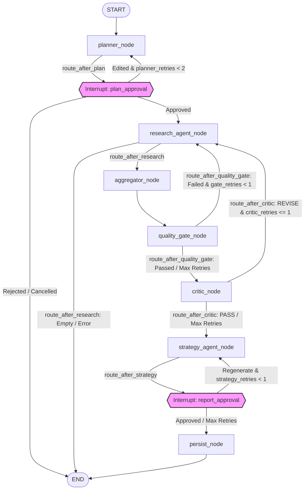

<p align="center">
  
</p>

<h1 align="center">Stratix</h1>
<p align="center"><strong>Autonomous Multi-Agent Market Intelligence Platform</strong></p>

<p align="center">
  <a href="https://python.org"></a>
  <a href="https://langchain-ai.github.io/langgraph/"></a>
  <a href="https://fastapi.tiangolo.com"></a>
  <a href="https://streamlit.io/"></a>
  <a href="https://www.sqlite.org/"></a>
  <a href="https://www.sqlalchemy.org/"></a>
  <a href="https://ai.google.dev"></a>
  <a href="https://www.langchain.com/langsmith"></a>
  <a href="https://plotly.com/"></a>
  <a href="https://www.docker.com"></a>
  <a href="https://docs.pytest.org/"></a>
  <a href="https://huggingface.co/"></a>
</p>

<div align="center">
  
  <p>
    <i>Stratix is a production-grade agentic AI platform that autonomously executes multi-step market intelligence research workflows. The platform orchestrates complex research tasks - including planning, structured tool execution, data aggregation, quality gating, adversarial critique, strategy synthesis, and checkpointer persistence through a stateful LangGraph pipeline. Designed for high reliability, it integrates human-in-the-loop (HITL) checkpoints to allow manual approval and state modification mid-execution. By combining robust database engineering with systematic LLM-as-judge evaluation, Stratix converts raw search and competitor data into validated, high-impact strategic intelligence.</i>
  </p>

  <h3>🔗 <a href="https://youtube.com/...">Stratix - Observe. Analyze. Strategize. Autonomously.</a></h3>
  
  <p>
    The demo link above features a video walkthrough demonstrating Stratix running the autonomous agent pipeline, real-time node-by-node execution streaming, intermediate research data validation, and interactive human-in-the-loop approval gates.
  </p>

  <p><sub><strong>Note:</strong> While Stratix features a fully automated continuous-deployment pipeline that pushes updates to Hugging Face Spaces, the hosted instance is kept private to preserve API credit limits and quota budgets for upstream search and forecasting providers.</sub></p>
</div>

---

## What Stratix Does

Stratix automates the end-to-end market intelligence process:

1. **Initialize and Plan**: The operator submits a seed keyword or research topic. Stratix generates a structured research plan defining target modules (e.g., keyword discovery, competitor gap, SERP analysis, trend forecasting, topic clustering) and keyword limits.
2. **Human-in-the-Loop Verification**: The pipeline pauses at a stateful checkpoint. The operator inspects the proposed research plan, makes manual modifications to parameters if needed, and approves it to trigger tool execution.
3. **Autonomous Research Execution**: A ReAct agent runs specialized tools against search APIs and forecasting models. The system streams the agent's progress node-by-node to the UI in real time.
4. **Data Aggregation and Quality Gate**: Collected data is merged, and confidence scores are calculated. A deterministic quality gate validates minimum keyword counts and volume thresholds. If the data is insufficient, the loop backtracks to the research node.
5. **Adversarial Critique**: An LLM-based Critic Node audits the findings, looking for unsupported claims, low-confidence tool data, or structural gaps. It yields a PASS or REVISE verdict, triggering a structured retry loop if revisions are required.
6. **Strategy Synthesis**: Upon passing all gates, the Strategy Node compiles the findings into an Executive Intelligence Workspace report containing landscape analyses, risks, recommendations, and execution timelines.
7. **Operator Report Approval**: The graph pauses for a final human review. The operator can approve the report to commit it to the database, or write modification notes and trigger a single-click regeneration of the strategy.
8. **Continuous Monitoring**: Approved keywords can be configured for recurring tracking, automatically checking search metrics at scheduled intervals and computing strategy diffs over time.

---

## Architecture Overview

Stratix orchestrates its workflow using a stateful LangGraph execution engine. State transitions, tool parameters, and checkpointer states are preserved in SQLite.



### Cyclical Routing & Retries
The pipeline implements two operational retry loops designed to resolve execution issues dynamically:
* **Research Rectification Cycle**: Triggers when the deterministic `quality_gate_node` fails or when the adversarial `critic_node` returns a `REVISE` verdict. If retry budgets allow, execution flows back to `research_agent_node` to gather additional or cleaner data.
* **Strategy Refinement Cycle**: Pauses at the `report_approval` interrupt. If a human operator requests modifications, the graph routes back to `strategy_agent_node` to regenerate the report incorporating operator notes.

### Retry Budgets
* **Planner Retries (`planner_retries`)**: < 2 loops. Controlled in `route_after_plan`.
* **Gate Retries (`gate_retries`)**: < 1 loop. Controlled in `route_after_quality_gate`.
* **Critic Retries (`critic_retries`)**: <= 1 loop. Controlled in `route_after_critic`.
* **Strategy Retries (`strategy_retries`)**: < 1 loop. Controlled in `route_after_strategy`.

---

## Engineering Decisions & Why

### LangGraph for Stateful, Cyclical, Checkpointed Orchestration
* **Decision**: We implemented the multi-agent system using LangGraph's compile-time state graph.
* **Why**: Writing custom routing for paused threads, human approvals, and retry loops is highly error-prone. LangGraph's native thread checkpointing and `SqliteSaver` manage the state transitions automatically.
* **Trade-offs**: Strict dependency on LangGraph's schema structures; updates to the graph structure require schema-compliant state variables.

### SQLite + WAL over PostgreSQL
* **Decision**: We chose SQLite configured with Write-Ahead Logging (WAL) and SQLAlchemy connection pools.
* **Why**: PostgreSQL provides superior horizontal scalability but adds deployment overhead for portfolio showcases. SQLite in WAL mode permits concurrent reads and non-blocking writes. Database locks are managed using SQLAlchemy listeners to auto-retry blocked operations for up to 5 seconds.
* **Trade-offs**: Single-writer limitations under high concurrency. If scaled to enterprise usage, migrating to PostgreSQL would be required.

### APScheduler + SQLAlchemy Jobstore over Celery + Redis
* **Decision**: Background recurring monitoring tasks run on an APScheduler `BackgroundScheduler` backed by an SQLite jobstore.
* **Why**: Eliminates the need to configure separate Redis brokers and Celery worker processes. Background jobs execute inside the main FastAPI process thread pool while retaining persistent intervals.
* **Trade-offs**: Jobs cannot run if the main FastAPI application crashes, though schedules resume automatically upon container boot.

### Multi-Model Gemini Fallback Chain
* **Decision**: Structured generation calls use a fallback chain utilizing LangChain's `with_fallbacks()` mechanism.
* **Why**: Rate limit exhaustion or transient failures on a single LLM API break long-running research tasks mid-execution. A cascading model fallback chain ensures the graph completes execution.
* **Trade-offs**: Slight variation in formatting precision when falling back to smaller models, mitigated by strict Pydantic parsing schemas.

### LLM-as-Judge Evaluation
* **Decision**: Qualitative metrics are assessed using Gemini-based judges running at a static `temperature=0.0`.
* **Why**: Static assertions cannot evaluate semantic clarity or strategic consistency. The LLM judge grades outputs against structured rubrics.
* **Trade-offs**: Introduces extra LLM API latency and token costs during the final execution stage.

### Deterministic Quality Gate Before LLM-Based Critic
* **Decision**: We run a deterministic validation gate (`quality_gate_node`) before routing to the LLM-based `critic_node`.
* **Why**: Fails fast and cheaply on simple quantitative failures (e.g., zero keywords or empty volumes) before spending API tokens on qualitative LLM evaluations.
* **Trade-offs**: Adds minor routing logic and state metadata to the overall graph structure.

### Scoped Tenacity Retries
* **Decision**: Tenacity retry decorators are target-scoped to specific exceptions (such as network drops and rate limits).
* **Why**: Avoids blanket retries on base `Exception`, which can mask syntax or logical coding bugs and result in infinite retry loops.
* **Trade-offs**: Unhandled exception types bypass the retry mechanism and fail immediately.

### Continuous Deployment to Hugging Face Spaces
* **Decision**: GitHub Actions automatically deploys the application directly to Hugging Face Spaces on pushes to `main`.
* **Why**: Provides zero-infrastructure public hosting for a dual-service container setup (FastAPI + Streamlit). The Docker configuration launches FastAPI in the background and exposes Streamlit on the platform-required port 7860.
* **Trade-offs**: A single-container hosting solution is perfect for a portfolio demo but does not scale horizontally.

---

## Observability & Quality Assurance

### Execution Timeline Reconstruction
FastAPI routes capture state changes from the SQLite checkpointer. The `GET /timeline/{run_id}` endpoint reconstructs the timeline, calculating durations, tool calls, and node traversals for a clean visual representation in the UI.

### Prometheus Metrics
The `/metrics` endpoint exposes runtime metrics, including token usage, average execution latency, API call status, and quality validation scores, ready for standard Prometheus scraping.

### Health Endpoints
`GET /health/detailed` tracks external API connectivity, database availability, and hardware performance (memory/CPU consumption).

### Tool Confidence Rubrics
Confidence scores are calculated inside the `aggregator_node` after tool execution:

| Tool Name | Confidence Formula | Score Bands & Meaning |
| :--- | :--- | :--- |
| **`keyword_research`** | `fill_ratio = count / requested`<br>If $fill\_ratio \ge 1.0$: `1.0` if `avg_volume > 0` else `0.7`<br>Else: `fill_ratio * (1.0` or `0.7)` | **`1.0`**: Requested keyword count met with valid search volumes.<br>**`0.7`**: Count met but volumes are zero (Gemini fallback mode).<br>**`0.0 - 0.99`**: Count is below the requested threshold (scaled linearly). |
| **`serp_analysis`** | Evaluates list counts of `organic_results` and `people_also_ask` (PAA). | **`1.0`**: Organic results $\ge 5$ AND PAA questions $\ge 2$.<br>**`0.6`**: Organic results $\ge 3$ (PAA questions missing).<br>**`0.2`**: Underperforming data (Organic results $< 3$).<br>**`0.0`**: Tool failed or was skipped. |
| **`competitor_gap`** | Evaluates opportunity counts and the maximum competitor gap score found. | **`1.0`**: Opportunities found $\ge 3$ AND at least one gap score $> 70$.<br>**`0.5`**: Opportunities found $\ge 1$.<br>**`0.0`**: Tool failed or found zero opportunities. |
| **`trend_forecast`** | Ratio of keywords returning forecasts with statistical fit: $r\_squared > 0.3$. | **`0.0 - 1.0`**: Linear ratio representing the proportion of keywords with reliable forecasting curves. |
| **`topic_cluster`** | Evaluates total cluster count and the average keyword count per cluster. | **`1.0`**: Clusters $\ge 3$ AND average keywords per cluster $\ge 3$.<br>**`0.5`**: Clusters $\ge 2$.<br>**`0.2`**: Only 1 cluster formed.<br>**`0.0`**: Tool failed or found zero clusters. |

---

## Continuous Intelligence / Monitoring

Operators can configure recurring monitoring schedules for target search domains.
* **APScheduler Daemon**: Automatically kicks off the multi-agent pipeline at configured intervals.
* **Report Diffing Engine**: The backend compares consecutive generated reports, calculating changes in keyword ranking, competitor positioning, search volumes, and overall intent shifts.
* **Alerting and Trends**: Surfaces critical shifts, indicating emerging search opportunities or competitive threats directly on the dashboard.

---

## Business Value

* **Zero-Tax Research Operations**: Replaces hours of manual SEO and competitor scraping with a single-click autonomous workflow.
* **High-Trust Output**: Rather than accepting LLM output blindly, every research block passes structural audits and adversarial reviews before compilation.
* **Optimized Human Intervention**: Places approval boundaries exactly where they matter: confirming the search trajectory and validating the final recommendations.
* **Proactive Strategy Adjustments**: Recurring scheduling tracks market movements, informing marketing teams of volume surges or competitor strategies automatically.

---

## Tech Stack Table

| Component | Technology | Why Chosen |
| :--- | :--- | :--- |
| **Orchestrator** | LangGraph | Stateful execution, support for cyclical loops, and native human-in-the-loop checkpoint interrupts. |
| **LLMs** | Gemini (via LangChain) | Large context window, native JSON schema outputs, and structured call reliability. |
| **UI Dashboard** | Streamlit | Rapid prototyping of dashboard views and timeline builders. |
| **Web Server** | FastAPI | High-performance asynchronous endpoint routing and Server-Sent Events (SSE) support. |
| **Database** | SQLite + WAL | Zero-configuration local deployment; WAL mode enables safe concurrent transactions. |
| **Task Scheduler**| APScheduler | Direct integration with FastAPI process and SQLite database store. |
| **Observability** | LangSmith & OpenTelemetry | In-depth agent tracing and step-by-step token tracking. |

---

## Quick Start

### Setup Keys & Environment
1. Clone the repository and navigate to the project directory:
   ```bash
   git clone https://github.com/Shafia01/stratix-intelligence.git
   cd stratix-intelligence
   ```

2. Copy the environment template and insert your API keys:
   ```bash
   cp .env.example .env
   ```
   Add your keys to `.env`:
   * `GEMINI_API_KEY`: Google AI Studio API Key.
   * `SERPAPI_KEY`: SerpApi key for Google search scraping.

### Option A: Local Development Setup (Direct Run)
Ensure you have Python 3.11+ installed.

1. Create and activate a Python virtual environment:
   ```bash
   python -m venv venv
   # On macOS/Linux:
   source venv/bin/activate
   # On Windows (PowerShell):
   .\venv\Scripts\Activate.ps1
   ```

2. Install dependencies:
   ```bash
   pip install --upgrade pip
   pip install -r requirements.txt
   ```

3. Launch the FastAPI server:
   ```bash
   uvicorn api.main:app --host 0.0.0.0 --port 8000
   ```

4. Launch the Streamlit dashboard in a separate terminal window (ensure the virtual environment is active):
   ```bash
   streamlit run app.py --server.port 8501 --server.address 0.0.0.0
   ```

5. Access the services:
   * Streamlit App: `http://localhost:8501`
   * Swagger API Docs: `http://localhost:8000/docs`

### Option B: Local Containerized Setup (Docker Compose)
Ensure you have Docker and Docker Compose installed.

1. Run the containerized services:
   ```bash
   docker-compose up --build
   ```

2. Access the services:
   * Streamlit Frontend: `http://localhost:8501`
   * FastAPI Documentation: `http://localhost:8000/docs`

---

## Documentation

* [API Specification](docs/API.md) - Endpoint contracts, request parameters, and response schemas.
* [Architecture Deep Dive](docs/ARCHITECTURE.md) - Detailed descriptions of nodes, states, and confidence metrics.
* [Design Decisions Log](docs/DESIGN_DECISIONS.md) - Full analysis of engineering choices and tradeoffs.

---

## Project Structure

```
├── .github/workflows/
│   └── ci.yml               # CI pipeline running lints, tests, and auto-pushes to Hugging Face Spaces
├── api/
│   ├── routes/
│   │   ├── agent.py         # Agent execution control & real-time SSE /stream endpoint
│   │   ├── evals.py         # LLM-as-judge evaluation results & trends
│   │   ├── health.py        # System health status
│   │   ├── intelligence.py  # Single-shot analysis endpoints (SERP, competitor, trends)
│   │   ├── keywords.py      # Seed keyword research suggestions
│   │   ├── monitor.py       # Recurring monitor configurations & diff comparison
│   │   ├── observability.py # Prometheus /metrics & detailed systems diagnostic
│   │   └── timeline.py      # Run checkpoint history parser
│   ├── dependencies.py
│   └── main.py              # FastAPI app setup, CORS, error boundaries, lifespan routines
├── docs/
│   ├── API.md
│   ├── ARCHITECTURE.md
│   └── DESIGN_DECISIONS.md
├── src/
│   ├── graph/
│   │   ├── graph.py         # LangGraph topology construction and checkpointer configuration
│   │   ├── nodes.py         # Node executors (planner, research agent, aggregator, quality gate, critic, strategy, persist)
│   │   ├── state.py         # Typed schema defining LangGraph state variables
│   │   └── tracing.py       # Run meta initialization and logging helper
│   ├── tools/
│   │   ├── competitor_gap_tool.py
│   │   ├── intent_classifier_tool.py
│   │   ├── keyword_research_tool.py
│   │   ├── langchain_adapters.py
│   │   ├── registry.py      # Core tool discovery and registration interface
│   │   ├── serp_analysis_tool.py
│   │   ├── topic_cluster_tool.py
│   │   └── trend_forecast_tool.py
│   ├── ui/
│   │   ├── agent_mode.py    # Streamlit views for research runs and live execution streaming
│   │   ├── agent_timeline.py# Visual step durations from checkpointer
│   │   ├── analytics.py     # Evaluation trends, pass/revise metrics, and LangSmith shortcuts
│   │   ├── components.py    # Reusable styled UI elements (cards)
│   │   ├── executive_reports.py # Executive Intelligence report workspace
│   │   ├── home.py          # Dashboard dashboard and product landing view
│   │   ├── monitoring_dashboard.py # Scheduled monitors and report diffing workspace
│   │   ├── sidebar.py       # Two-tier primary/secondary sidebar control panel
│   │   └── theme.py         # Custom stylesheet overrides (Cambria default, no-emoji visual hierarchy)
│   ├── db_client.py
│   ├── models.py            # SQLAlchemy schema models
│   ├── scheduler.py         # APScheduler recurring task daemon
│   └── report_diff.py       # Structural report comparator
├── app.py                   # Streamlit entry point
├── docker-compose.yml       # Dev configuration
├── Dockerfile               # Production Dockerfile (dual-process hosting on Hugging Face Spaces)
├── Dockerfile.fastapi       # FastAPI container builder
├── Dockerfile.streamlit     # Streamlit container builder
└── requirements.txt
```

---

## What This Demonstrates

* **Agentic Event Streaming**: Asynchronous execution monitoring using LangGraph's event streaming API (`astream_events`), updating client states live.
* **Persistent Checkpoint Recovery**: Resuming execution threads from exact, database-backed state checkpoints after intentional interrupts.
* **Hybrid Quality Assurance**: Coupling low-cost deterministic gates with LLM-as-judge critiquing nodes to maintain validation parameters.
* **Robust Integration Standards**: Building resilient API connection nodes using custom Tenacity schemas targeting specific networking exceptions.
* **Zero-Infra CD**: Automating environment tests and linting via GitHub Actions before deployment.

---

## Roadmap

* **Distributed State Savers**: Implement Redis-backed graph checkpoints to scale concurrent execution threads.
* **Role-Based Access Control**: Secure individual workspaces and custom API configurations.
* **Vector Store Integrations**: Allow research agents to query local knowledge libraries and documentation sets.
* **PDF Report Compilation**: Generate print-ready executive summaries directly from the workspace.
