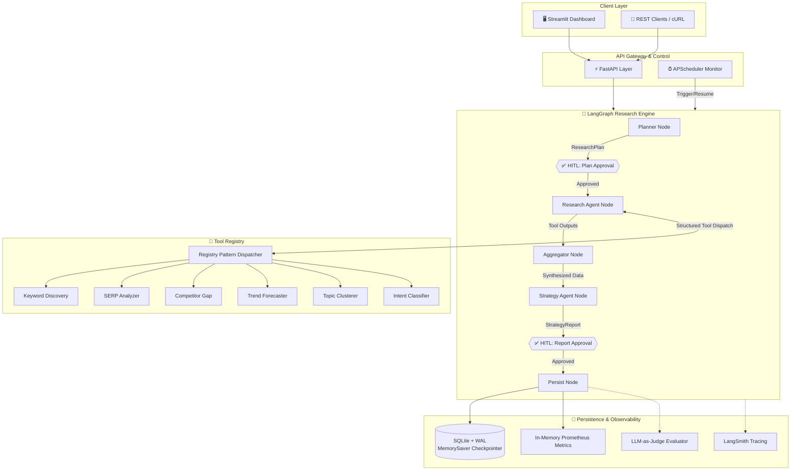

<div align="center">
  
  <h1><strong>Keylytics</strong></h1>
  <h3>Autonomous Multi-Agent Market Intelligence Platform</h3>
  <p>
    
    
    
    
    
  </p>
  <p><em>An autonomous market intelligence agentic engine that orchestrates multi-tool workflows, human-in-the-loop validation, and real-time intelligence collection to synthesize comprehensive market positioning reports.</em></p>
</div>

---

## What It Does

Manual market and SEO analysis is slow, inconsistent, and fails to scale due to the fragmentation of source data, search intent complexity, and content verification needs. Keylytics solves this by executing an autonomous multi-agent research pipeline that crawls search engine results, identifies competitor visibility gaps, clusters target terms, and forecasts search interest trends. It coordinates these steps through human approval gates to ensure alignment before running costly scraping jobs and before finalizing strategic recommendations. The underlying system leverages LangGraph for structured orchestration, human-in-the-loop (HITL) checkpoints, and an LLM-as-judge evaluation framework, serving as a production-grade portfolio demonstrating enterprise-level GenAI engineering.

---

## Architecture Overview

Keylytics is organized around a central state graph orchestrating high-fidelity execution nodes, integrated directly with a tool registry, a monitoring system, and a persistent storage layer.



---

## Technical Highlights

### Agentic Architecture
* **LangGraph StateGraph & Persistence**: Coordinates execution utilizing a structured `StateGraph` with state checkpointing via `MemorySaver` and `SqliteSaver`, allowing research operations to pause, survive process restarts, and resume deterministically.
* **ReAct Agent & Registry Pattern**: Decouples tools from execution via a structured registry pattern. The research node uses a ReAct pattern loop to autonomously select and execute tools from the 6-tool suite based on the planned objectives.
* **Human-in-the-Loop (HITL) Interrupts**: Injects state interrupts at key transition boundaries: once after plan generation (allowing users to modify or reject the scope) and once after report synthesis (allowing strategic feedback or manual validation).
* **Typed Routing & Conditional Flows**: Utilizes strongly-typed routing functions to evaluate state criteria and determine edge transitions (e.g., plan approval status, retry budgets, or verification failure counts).

### Evaluation & Observability
* **LLM-as-Judge Quality Framework**: Automates evaluation of research plans and generated reports using LLM-as-judge evaluators. The system grades inputs against structured, multi-dimensional rubrics (e.g., plan coverage, strategy depth, and tool call relevance).
* **In-Memory Prometheus Metrics**: Exposes real-time system performance (e.g., run latency, tool execution success rates, and token consumption) using Prometheus-compatible gauges and counters with label cardinality.
* **LangSmith Run Tracing**: Captures nested agent decisions, tool arguments, LLM prompts, and completion structures, tagged with unique `run_id` and metadata filters for prompt engineering debugging.
* **Granular Confidence Scoring**: Calculates confidence metrics per tool output using mathematical heuristics combined with LLM judgment to quantify reliability and domain density.

### Reliability Engineering
* **Tenacity Retries with Exponential Jitter**: Mitigates transient network failures and LLM rate-limiting by decorating API calls with exponential backoff and randomized jitter, scoped strictly to recoverable exceptions.
* **Token & Call Rate-Limiting**: Enforces rate-limiting on external API integrations to respect upstream vendor quotas and handle throttling gracefully.
* **SQLite WAL & Busy Timeout**: Configures SQLite in Write-Ahead Logging (WAL) mode with a generous `busy_timeout` to support concurrent read/write locks during parallel agent execution.
* **Error-as-Result Semantics**: Prevents runtime crashes in agent loops by trapping tool-level failures, wrapping them in structured error payloads, and returning them to the agent state as feedback rather than bubble-raising.

### Production Patterns
* **Persistent Monitoring & Scheduling**: Employs an `APScheduler` loop backed by a SQLAlchemy job store to coordinate recurring audits, monitor pipeline status, and automate execution policies.
* **Automated Report Diffing**: Computes semantic and structured diffs between successive execution runs, highlighting shifts in competitive positioning or search trends.
* **Security & Key Redaction**: Implements automatic regex-based API key redaction in logging middleware and sanitizes user input templates to mitigate prompt injection vectors.
* **Containerized Deployment**: Packaged with multi-stage `Dockerfiles` and configured via `docker-compose` for local orchestration, resource isolation, and quick environment setups.

---

## Quick Start

### Docker (Recommended)
```bash
git clone <repository-url>
cd keylytics
cp .env.example .env
# Edit .env with your GEMINI_API_KEY and SERPAPI_KEY
docker-compose up --build
```

### Local Development
```bash
pip install -r requirements.txt
cp .env.example .env  # Configure GEMINI_API_KEY & SERPAPI_KEY
uvicorn api.main:app --port 8000 & streamlit run app.py
```

---

## API Reference

The FastAPI service exposes endpoints to run, pause, and query the agentic pipeline.

### 1. Execute Research Run
Starts a new intelligence research pipeline for a target search keyword. The graph executes the planner node and pauses at the `plan_approval` checkpoint.
* **Endpoint**: `POST /agent/run`
* **Request**:
  ```json
  {
    "seed_keyword": "AI agents in enterprise"
  }
  ```
* **Response**:
  ```json
  {
    "run_id": "8fa11be8-761a-4d7a-b9c1-404321b1fa9c",
    "status": "awaiting_approval",
    "checkpoint": "plan_approval",
    "research_plan": {
      "objectives": ["Identify target search demographics", "Evaluate competitor coverage"],
      "queries": ["enterprise AI agent orchestration", "agentic market landscape"]
    }
  }
  ```

### 2. Resume Pipeline (Submit HITL Feedback)
Resumes a suspended research pipeline from a checkpoint by providing approval or feedback.
* **Endpoint**: `POST /agent/resume`
* **Request**:
  ```json
  {
    "run_id": "8fa11be8-761a-4d7a-b9c1-404321b1fa9c",
    "human_feedback": {
      "approved": true,
      "feedback_notes": "Looks solid. Focus heavily on security concerns."
    }
  }
  ```
* **Response**:
  ```json
  {
    "run_id": "8fa11be8-761a-4d7a-b9c1-404321b1fa9c",
    "status": "awaiting_approval",
    "checkpoint": "report_approval",
    "strategy_report": {
      "executive_summary": "Enterprise adoption of AI agents is bottlenecked by orchestration reliability...",
      "recommendations": ["Implement robust state checkpointers", "Standardize tool-calling schema validation"]
    }
  }
  ```

### 3. Retrieve Status
Fetches the current runtime status, active checkpoint state, and execution history.
* **Endpoint**: `GET /agent/status/{run_id}`
* **Response**:
  ```json
  {
    "run_id": "8fa11be8-761a-4d7a-b9c1-404321b1fa9c",
    "status": "completed",
    "current_node": "persist_node",
    "metrics": {
      "elapsed_seconds": 42.5,
      "token_usage": 18450
    }
  }
  ```

### Complete End-to-End Workflow
```bash
# 1. Initiate the run (pauses at plan approval)
curl -X POST http://localhost:8000/agent/run \
  -H "Content-Type: application/json" \
  -d '{"seed_keyword": "AI SEO tools"}'

# 2. Approve the plan (resumes execution, runs tools, pauses at report approval)
curl -X POST http://localhost:8000/agent/resume \
  -H "Content-Type: application/json" \
  -d '{"run_id": "8fa11be8-761a-4d7a-b9c1-404321b1fa9c", "human_feedback": {"approved": true}}'

# 3. Approve the final report (saves to DB, transitions state to completed)
curl -X POST http://localhost:8000/agent/resume \
  -H "Content-Type: application/json" \
  -d '{"run_id": "8fa11be8-761a-4d7a-b9c1-404321b1fa9c", "human_feedback": {"approved": true}}'

# 4. Confirm completion status
curl -X GET http://localhost:8000/agent/status/8fa11be8-761a-4d7a-b9c1-404321b1fa9c
```

---

## Engineering Decisions

### 1. State Orchestration: LangGraph vs. While Loop
We chose LangGraph over a traditional loops-and-conditionals controller because the research pipeline requires stateful persistence, complex cycle management, and multiple asynchronous interrupts. While a while-loop can easily dispatch tools sequentially, it becomes fragile when managing checkpoints (e.g., enabling a pipeline to resume from the exact node it failed on or paused at for human input). LangGraph's native checkpointer abstraction (`MemorySaver`/`SqliteSaver`) externalizes state machine serialization, allowing the execution flow to be defined declaratively as a directed graph.

### 2. Storage Engine: SQLite vs. PostgreSQL
SQLite was selected over PostgreSQL to simplify local deployment overhead for a portfolio project without sacrificing concurrency capabilities. By configuring SQLite in Write-Ahead Logging (WAL) mode and adjusting the SQLAlchemy connection settings with a `busy_timeout` of 30 seconds, the engine successfully handles concurrent read-heavy operations and concurrent agent writes. This design avoids the infrastructure complexity of managing a separate database service while still matching the transactional guarantees needed for the research runtime.

### 3. Observability Architecture: In-Memory Prometheus Metrics
To maintain a zero-dependency local setup, the service exports Prometheus-format metrics using an in-memory registry rather than requiring a dedicated Prometheus/Grafana server stack. This design keeps the codebase highly portable: recruiters can inspect the raw `/metrics` endpoint directly to verify metric definitions and labels (e.g., counting tool executions, tracking latencies, and tracing errors) without executing external infrastructure.

### 4. Quality Validation: LLM-as-Judge vs. Unit Testing
Traditional unit tests are excellent for checking deterministic code paths but fail to evaluate the subjective quality of research plans and synthesized intelligence reports. We implemented an LLM-as-judge framework using Gemini 2.5 Flash to automatically score output quality across distinct dimensions (such as target coverage, source relevance, and strategic actionable clarity) against defined grading rubrics. This mimics a production deployment where continuous automated evaluations identify regressions in agent performance that cannot be caught by assertion checking alone.

---

## Tech Stack Table

| Layer | Technology | Why |
|---|---|---|
| **API Gateway** | [FastAPI](https://fastapi.tiangolo.com/) | High performance, automatic OpenAPI documentation generation, and native support for asynchronous path operations. |
| **Orchestration** | [LangGraph](https://langchain-ai.github.io/langgraph/) | Declarative state machine framework supporting cyclical graphs, state persistence, and native human-in-the-loop interrupts. |
| **Observability** | [LangSmith](https://www.langchain.com/langsmith) | Comprehensive execution tracing, prompt version debugging, and performance diagnostic collection. |
| **Language Model** | [Gemini 2.5 Flash](https://ai.google.dev/) | Low-latency inference, substantial context window, and robust tool-calling support. |
| **Persistence** | [SQLite](https://www.sqlite.org/) / [SQLAlchemy](https://www.sqlalchemy.org/) | Embedded relational database using WAL mode to handle concurrent locks; SQLAlchemy ORM provides schema modeling. |
| **Task Scheduler** | [APScheduler](https://apscheduler.readthedocs.io/) | Job orchestration with database-backed stores to trigger recurring background crawls and cleanups. |
| **User Interface** | [Streamlit](https://streamlit.io/) | Dynamic frontend framework for real-time visualization of agent progress and plan review interfaces. |
| **Validation** | [Pydantic v2](https://docs.pydantic.dev/) | Modern, fast data parsing and validation utilizing type hints for request/response serialization. |
| **Resiliency** | [Tenacity](https://tenacity.readthedocs.io/) | Declarative retry configurations featuring exponential backoff, jitter, and customizable exception filtering. |
| **Metrics** | Prometheus Text Format | Standardized exposition format for system health, execution times, and pipeline metrics. |
| **Containerization** | [Docker](https://www.docker.com/) / Docker Compose | Standardizes environment isolation, local networking setup, and multi-stage image builds. |
| **Testing** | [pytest](https://docs.pytest.org/) | Structured unit and integration testing support featuring clean fixture management and code coverage reporting. |
| **Code Quality** | [Ruff](https://docs.astral.sh/ruff/) | Extremely fast linter and formatter keeping pythonic standards uniform across all packages. |

---

## What This Is Not

Keylytics is not a tutorial project or template repository showing simple langchain wrappers. It is built as a portfolio demonstrating how to design and build production-grade agentic platforms. The codebase implements advanced software engineering principles including resilient connection pooling, rate-limiting handlers, dynamic tool registries, human-in-the-loop interrupts, structured logging, in-memory metric collections, and automated LLM evaluation rubrics—patterns required to confidently operate agentic workflows in enterprise settings.

---

## License

This repository is a personal project built for educational and portfolio demonstration purposes. All rights reserved. You are welcome to review the source code for evaluation and architectural review, but commercial reproduction or redistribution is not permitted.
