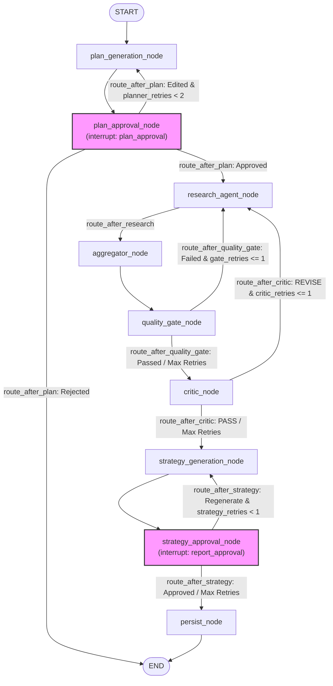

<p align="center">
  
</p>

<h1 align="center">Stratix</h1>
<p align="center"><strong>Autonomous Multi-Agent Market Intelligence Platform</strong></p>

<p align="center">
  <a href="https://python.org"></a>
  <a href="https://langchain-ai.github.io/langgraph/"></a>
  <a href="https://fastapi.tiangolo.com"></a>
  <a href="https://streamlit.io/"></a>
  <a href="https://www.sqlite.org/"></a>
  <a href="https://www.sqlalchemy.org/"></a>
  <a href="https://ai.google.dev"></a>
  <a href="https://www.langchain.com/langsmith"></a>
  <a href="https://plotly.com/"></a>
  <a href="https://www.docker.com"></a>
  <a href="https://docs.pytest.org/"></a>
  <a href="https://huggingface.co/"></a>
</p>

<div align="center">
  <p>
    <i>Stratix is an agentic AI platform that executes multi-step market intelligence research workflows. The platform orchestrates research tasks through a stateful LangGraph-based multi-agent pipeline that plans, researches with tools, aggregates with confidence scoring, applies a deterministic quality gate and an LLM critic, synthesizes a strategy report, and pauses for human approval at two checkpoints. By combining SQLite checkpointer persistence with systematic LLM-as-judge evaluation, Stratix converts raw search and competitor data into structured strategy reports.</i>
  </p>

  <p><strong>Note:</strong> While Stratix features an automated continuous-deployment pipeline that pushes updates to Hugging Face Spaces, the hosted instance is kept private to preserve API credit limits and quota budgets for upstream search and forecasting providers.</p>
</div>

---

## What Stratix Does

Stratix automates the end-to-end market intelligence process:

1. **Initialize and Plan**: The operator submits a seed keyword or research topic. Stratix generates a structured research plan defining target modules (keyword discovery, competitor gap, SERP analysis, trend forecasting, topic clustering) and a keyword limit (max_keywords is capped at 5 per run in schemas.py).
2. **Human-in-the-Loop Verification**: The pipeline pauses at a stateful checkpoint (plan_approval). The operator reviews the proposed research plan and approves or rejects it. The graph contains an edited-plan re-validation route.
3. **Autonomous Research Execution**: A ReAct agent receives only the tools for the modules in the plan. Progress is streamed over SSE (POST /agent/stream, via astream_events). Tools are invoked through invoke_tool(), which returns errors as data instead of raising.
4. **Data Aggregation and Quality Gate**: Collected data is merged in aggregator_node, and confidence scores are calculated. A deterministic quality gate validates that keyword-research confidence is >= 0.3 and at least 3 keywords were returned. Retries are targeted at the failing tools (retry_target_tools).
5. **Adversarial Critique**: An LLM-based Critic Node audits the findings, identifying weak claims, data gaps, or structural issues. The critic's PASS/REVISE verdict can trigger one targeted research retry, and on critic failure the verdict defaults to PASS.
6. **Strategy Synthesis**: Upon passing all gates, the Strategy Node compiles the findings into a strategy report containing an executive summary, up to 5 top opportunities, and 5 recommendations. The Executive Reports page additionally shows confidence breakdown, competitor gaps, risks and data limitations, a link to the execution timeline, and Markdown export.
7. **Operator Report Approval**: The graph pauses for a final human review (report_approval). The operator reviews the report and approves it to persist it to the database. The graph contains a regeneration route guarded by a retry budget.
8. **Continuous Monitoring**: Monitored keywords run on recurring schedules via APScheduler, diffing consecutive reports and storing score changes over time.

### Single-Shot Tools

In addition to the multi-agent pipeline, Stratix provides standalone single-shot utilities for keyword discovery, competitor gap, SERP analysis, topic clustering, trend forecasting, and a full strategy utility in the Streamlit sidebar. These utilities map directly to the `/keywords` and `/intelligence` REST endpoints detailed in the [API Specification](docs/API.md).

---

## Architecture Overview

Stratix orchestrates its workflow using a stateful LangGraph execution engine. State transitions, tool parameters, and checkpointer states are preserved in SQLite.


```mermaid
graph TD
    START([START]) --> plan_generation_node[plan_generation_node]
    plan_generation_node --> plan_approval_node["plan_approval_node<br/>(interrupt: plan_approval)"]
    
    plan_approval_node -->|route_after_plan: Approved| research_agent_node[research_agent_node]
    plan_approval_node -->|route_after_plan: Edited & planner_retries < 2| plan_generation_node
    plan_approval_node -->|route_after_plan: Rejected| END([END])
    
    research_agent_node -->|route_after_research| aggregator_node[aggregator_node]
    
    aggregator_node --> quality_gate_node[quality_gate_node]
    
    quality_gate_node -->|route_after_quality_gate: Failed & gate_retries <= 1| research_agent_node
    quality_gate_node -->|route_after_quality_gate: Passed / Max Retries| critic_node[critic_node]
    
    critic_node -->|route_after_critic: REVISE & critic_retries <= 1| research_agent_node
    critic_node -->|route_after_critic: PASS / Max Retries| strategy_generation_node[strategy_generation_node]
    
    strategy_generation_node --> strategy_approval_node["strategy_approval_node<br/>(interrupt: report_approval)"]
    
    strategy_approval_node -->|route_after_strategy: Regenerate & strategy_retries < 1| strategy_generation_node
    strategy_approval_node -->|route_after_strategy: Approved / Max Retries| persist_node[persist_node]
    
    persist_node --> END([END])

    style plan_approval_node fill:#f9f,stroke:#333,stroke-width:2px
    style strategy_approval_node fill:#f9f,stroke:#333,stroke-width:2px
```

### Cyclical Routing and Retry Budgets

The pipeline incorporates bounded retry loops driven by routing functions in `src/graph/nodes.py`:

* **Research Retry Cycle**: When `quality_gate_node` identifies failing data standards or `critic_node` returns a `REVISE` verdict, execution routes back to `research_agent_node` with targeted tool lists (`retry_target_tools`).
* **Strategy Regeneration Cycle**: When an operator requests revisions at the `report_approval` interrupt checkpoint, execution routes back to `strategy_generation_node`.
* **Budget Limits**: Effective execution behavior enforces strict bounds:
  * The quality gate allows at most one re-run of research (`gate_retries <= 1`).
  * The critic allows at most one re-run (`critic_retries <= 1`).
  * Edited-plan re-validation is capped at 2 (`planner_retries < 2`).
  * The strategy regeneration route is guarded by `strategy_retries < 1`.

---

## Engineering Decisions & Why

### LangGraph for Stateful Orchestration
* **Decision**: We implemented the multi-agent system using LangGraph's StateGraph compiled with a custom `MixedSqliteSaver` checkpointer.
* **Why**: Writing manual state machines for thread pausing, human approval, and re-entry loops is error-prone. `MixedSqliteSaver` subclasses `SqliteSaver` with a re-entrant lock (`threading.RLock`) and delegates asynchronous methods to threads (`asyncio.to_thread`), enabling `astream_events` streaming while maintaining synchronous checkpointer compatibility.
* **Trade-offs**: Graph states must conform strictly to `AgentState` schema dictionaries.

### SQLite + WAL Persistence
* **Decision**: We chose SQLite with Write-Ahead Logging (WAL) mode and busy timeout configuration.
* **Why**: PRAGMA `journal_mode=WAL` and `busy_timeout=5000` are applied to the SQLAlchemy engine, the APScheduler jobstore engine, and the raw sqlite3 checkpointer connection. WAL allows concurrent reads alongside writes, while a 5-second busy timeout handles transient write locks.
* **Trade-offs**: SQLite permits a single writer at a time under concurrent operations.

### APScheduler with SQLAlchemy Jobstore
* **Decision**: Background recurring monitoring tasks run on an APScheduler `BackgroundScheduler` backed by an SQLite jobstore.
* **Why**: Eliminates external broker dependencies like Redis or Celery. The scheduled target is a module-level function so the SQLAlchemy jobstore can pickle it cleanly. The executor uses a thread pool of 3 workers inside the FastAPI process.
* **Trade-offs**: Background job execution depends on the FastAPI process remaining active.

### Multi-Model Fallback Chain
* **Decision**: Generation calls use a provider fallback chain built with LangChain's `with_fallbacks()`.
* **Why**: The provider chain supports Gemini and Groq via `PRIMARY_LLM_PROVIDER` and `FALLBACK_LLM_PROVIDER`. Empty responses (without tool calls) raise an exception to trigger the fallback model. Calls enforce a 45-second request timeout, and environment variables support model overrides. Default configured chains are:
  * `GEMINI_MODEL_CHAIN`: `["gemini-3.8-flash", "gemini-3.5-flash-lite"]`
  * `GROQ_MODEL_CHAIN`: `["openai/gpt-oss-120b", "openai/gpt-oss-20b"]`
  LLM JSON output is parsed and validated with Pydantic models, with fallback plans/reports on failure.
* **Trade-offs**: Output style and structure may vary across providers during fallback events.

### LLM-as-Judge Evaluation
* **Decision**: Three evaluations (`plan_quality`, `report_quality`, `tool_reliability`) run in a background daemon thread after `persist_node` and are stored in the `eval_results` table.
* **Why**: The evaluator uses the configured provider chain and requests temperature 0.0 where the model accepts sampling parameters. Running asynchronously in a background thread avoids adding execution delay to the persistence stage.
* **Trade-offs**: Asynchronous evaluations incur background API calls and token consumption.

### Deterministic Quality Gate Before LLM Critic
* **Decision**: A deterministic validation gate (`quality_gate_node`) executes before routing to `critic_node`.
* **Why**: Fails early on basic data thresholds (keyword count < 3 or keyword confidence < 0.3) before expending LLM tokens on adversarial critique.
* **Trade-offs**: Requires maintaining explicit quantitative rules in addition to qualitative prompts.

### Scoped Tenacity Retries
* **Decision**: Tenacity retry decorators target specific networking and recoverable exception types.
* **Why**: Avoids blanket retries on base `Exception`, ensuring programming errors surface immediately rather than looping.
* **Trade-offs**: Unhandled unexpected exception classes fail without automatic retry.

### Continuous Deployment
* **Decision**: GitHub Actions validates changes using Ruff and pytest, then force-pushes to a Hugging Face Space on `main`.
* **Why**: Automates testing and deployment. When run locally, `app.py` automatically launches the FastAPI backend as a subprocess when `API_BASE_URL` points to localhost and the port is closed. The repository Dockerfile configures a dual-process container running FastAPI on port 8000 and Streamlit on port 7860.
* **Trade-offs**: Single-container dual-process setups share CPU and memory resources between backend and frontend.

---

## Observability & Quality Assurance

### Execution Timeline Reconstruction
FastAPI reconstructs execution state transitions through `GET /timeline/{run_id}`. The endpoint extracts node transitions, HITL interrupts, tool-call counts, errors, confidence scores, critic verdict, and eval scores from checkpointer history.

### Prometheus Metrics
In-process metrics are collected in thread-safe memory and exposed in Prometheus exposition format at `GET /metrics`:
* `keylytics_tool_calls_total`: Counter tracking tool invocations by tool name and status.
* `keylytics_graph_runs_total`: Counter tracking graph run completions by terminal status.
* `keylytics_keyword_count_per_run`: Histogram tracking keywords gathered per run.
* `keylytics_plan_eval_score`: Histogram of plan quality evaluation scores.
* `keylytics_report_eval_score`: Histogram of report quality evaluation scores.
* `keylytics_monitoring_jobs_active`: Gauge tracking the count of currently active monitoring jobs.

### Health Endpoints
* `GET /health`: Liveness probe reporting database connectivity and Gemini API key presence.
* `GET /health/detailed`: Component diagnostic reporting database status, Gemini key presence, LangGraph compilation status, recent average eval scores, active job count, database row counts, and in-memory metrics summary.

### Tool Confidence Rubrics
Confidence scores are calculated in `aggregator_node` across research modules:

| Tool Name | Confidence Formula | Score Bands & Meaning |
| :--- | :--- | :--- |
| **`keyword_research`** | `fill_ratio = count / requested`<br>If $fill\_ratio \ge 1.0$: `1.0` if `avg_volume > 0` else `0.7`<br>Else: `round(fill_ratio * base, 2)` | **`1.0`**: Requested keyword count met with valid search volumes.<br>**`0.7`**: Count met but all volumes are zero.<br>**`0.0 - 0.99`**: Count is below the requested threshold (scaled linearly). |
| **`serp_analysis`** | Evaluates list counts of `organic_results` and `people_also_ask` (PAA). | **`1.0`**: Organic results $\ge 5$ and PAA questions $\ge 2$.<br>**`0.6`**: Organic results $\ge 3$.<br>**`0.2`**: Organic results $< 3$.<br>**`0.0`**: Tool failed or missing. |
| **`competitor_gap`** | Evaluates opportunity counts and maximum gap score. | **`1.0`**: Opportunities $\ge 3$ and at least one gap score $> 70$.<br>**`0.5`**: Opportunities $\ge 1$.<br>**`0.0`**: Zero opportunities or tool failed. |
| **`trend_forecast`** | Ratio of keywords with a non-empty forecast and $r\_squared > 0.3$ (or unavailable). | **`0.0 - 1.0`**: Fraction of keywords meeting non-empty forecast criteria. |
| **`topic_cluster`** | Evaluates cluster count and average keyword density. | **`1.0`**: Clusters $\ge 3$ and average keywords per cluster $\ge 3$.<br>**`0.5`**: Clusters $\ge 2$.<br>**`0.2`**: Exactly 1 cluster formed.<br>**`0.0`**: Zero clusters or tool failed. |

---

## Continuous Intelligence / Monitoring

Any seed keyword can be scheduled for recurring monitoring via `POST /monitor/add` with `interval_hours` between 1 and 168.
* **Auto-Approve Pipeline**: Each scheduled run executes the full pipeline in auto-approve mode and records run details to `research_run_logs`.
* **Report Diffing**: After each completed run, the new report is diffed against the previous completed run. The engine calculates keyword opportunity score deltas (classified as new, dropped, improved, or declined), added and dropped recommendations, and per-tool confidence score deltas.
* **Persistence & Retrieval**: Diffs are stored in the database and retrievable via `GET /monitor/diff/{seed_keyword}`.
* **Failure Circuit Breaker**: If a monitoring job encounters 3 consecutive failed runs, its status transitions to `paused_due_to_failures` (enforced via database checks at dispatch). Paused jobs can be resumed through `POST /monitor/{job_id}/resume` or the dashboard.

---

## Data Sources and Provenance

Stratix integrates data from multiple search intelligence providers with caching and fallback layers:
* **DataForSEO**: Supplies keyword suggestions, search volume, CPC, and competition density, with support for sandbox mode and credit-preservation switching.
* **SerpApi**: Fetches organic search results, People Also Ask questions, and competitor ranking data.
* **pytrends**: Retrieves Google Trends interest-over-time series, backed by a 7-day database cache.
* **LLM Fallbacks**: Generates fallback suggestions when external search APIs are unreachable or unconfigured.
* **Provenance Tagging**: Every `KeywordFinding` records its `data_source` and `trend_data_source` (`live`, `cached`, `estimated`, or `unavailable`). Values tagged as `estimated` derive from deterministic heuristics, not measured search engine data.

---

## Security and Input Handling

* **API Authentication**: Endpoints support `X-API-Key` header authentication verified against `STRATIX_API_KEY`. If no key variable is configured, requests bypass authentication in local development mode.
* **Prompt Sanitization**: Untrusted user text is sanitized to neutralize prompt injection patterns, capped in length, and isolated inside delimited blocks (`prompt_safety.py`).
* **Credential Redaction**: Sensitive API keys and credentials are automatically redacted from application log files and HTTP error messages (`security_utils.py`).
* **Schema Validation**: Tool inputs and API request bodies are validated against typed Pydantic models before execution.

---

## Testing

The test suite covers unit components, graph routing, API endpoints, and integrated pipeline execution:
* **Unit Tests**: Verify schemas, scoring formulas, data quality tags, client caching, security redaction, and prompt safety.
* **Graph & Routing Tests**: Validate node state transitions, conditional edges, quality gate evaluation, and checkpointer persistence.
* **API Route Tests**: Check HTTP status codes, request validation, SSE streaming format, and error handling wrappers.
* **Mocked Integrations**: External API calls (Google GenAI, SerpApi, DataForSEO, Google Trends) are mocked to ensure deterministic test runs without external network dependencies.
* **End-to-End Tests**: Dedicated suites test full graph execution (`test_full_graph_e2e.py`) and recurring monitoring pipelines (`test_monitoring_e2e.py`).

Test and validation commands:
* Run full test suite:
  ```bash
  python -m pytest tests/ -q
  ```
* Run linter:
  ```bash
  ruff check src/ api/ tests/ --select=E,W,F --ignore=E501,E402
  ```
* Run pre-push quality gate script:
  ```bash
  bash validate.sh
  ```
  `validate.sh` runs the Ruff lint check across `src/`, `api/`, and `tests/`, followed by pytest on `tests/graph/` and `tests/integration/test_full_graph_e2e.py` with `-q --tb=short`.

---

## Design Goals

* **Targeted Human Approval**: Operator review gates are placed at strategic checkpoints (initial research plan and final strategy report) to maintain control over execution scope and persisted recommendations.
* **Deterministic and Adversarial Gating**: A deterministic quality gate enforces minimum keyword counts and confidence thresholds before an adversarial LLM critic audits findings for unsupported claims.
* **Provenance and Confidence Transparency**: Numerical confidence scores and source provenance tags (`live`, `cached`, `estimated`) are surfaced directly in executive reports.
* **Scheduled Tracking with Report Diffs**: Background monitoring tracks keywords on recurring intervals, computing structured deltas across opportunity scores and strategic recommendations.

---

## Tech Stack Table

| Component | Technology | Why Chosen |
| :--- | :--- | :--- |
| **Orchestrator** | LangGraph (>=0.2.0) | Stateful execution, support for cyclical loops, and checkpointed human-in-the-loop interrupts. |
| **LLMs** | Gemini and Groq via LangChain (`langchain-google-genai`, `langchain-groq`) | Provider chain with fallbacks, request timeouts, and structured output parsing. |
| **External Data Providers** | DataForSEO, SerpApi, pytrends | Search volume, SERP analysis, and search trends with sandbox and caching support. |
| **Data Contracts** | Pydantic (>=2.0.0) | Strict schema validation and serialization across tool and API boundaries. |
| **UI Dashboard** | Streamlit | Rapid rendering of multi-page interactive dashboards and execution views. |
| **Web Server** | FastAPI (>=0.137.1) | Asynchronous REST routing, dependency injection, and SSE streaming via `astream_events`. |
| **Database** | SQLite + WAL (SQLAlchemy) | File-backed database with WAL mode and busy timeout for concurrent read/write access. |
| **Task Scheduler** | APScheduler (>=3.10.0) | In-process scheduling with persistent SQLAlchemy jobstore. |
| **Observability** | LangSmith & Prometheus metrics | LangSmith tracing (configured via `LANGCHAIN_*` env vars) and in-process Prometheus-format metrics. |

---

## Quick Start

### Setup Keys & Environment

1. Clone the repository and navigate to the project directory:
   ```bash
   git clone https://github.com/Shafia01/stratix-intelligence.git
   cd stratix-intelligence
   ```

2. Copy the environment template and insert your API keys:
   ```bash
   cp .env.example .env
   ```

### Environment Variables

| Variable | Requirement | Description |
| :--- | :--- | :--- |
| `GEMINI_API_KEY` | Required | Google AI Studio API Key. |
| `SERPAPI_KEY` | Required | SerpApi key for Google search scraping. |
| `GROQ_API_KEY` | Optional | Groq API Key (required if `FALLBACK_LLM_PROVIDER=groq`). |
| `PRIMARY_LLM_PROVIDER` | Optional | Primary provider (`gemini` by default). |
| `FALLBACK_LLM_PROVIDER` | Optional | Fallback provider (`groq` in `.env.example`; leave empty if no Groq key). |
| `GEMINI_MODEL` | Optional | Comma-separated Gemini model chain override. |
| `GROQ_MODEL` | Optional | Comma-separated Groq model chain override. |
| `GEMINI_THINKING_LEVEL` | Optional | Thinking level for Gemini 3.8 (`low`, `medium`, `high`). |
| `DATAFORSEO_USERNAME` | Optional | DataForSEO account login. |
| `DATAFORSEO_PASSWORD` | Optional | DataForSEO account password. |
| `DATAFORSEO_DEMO_MODE` | Optional | Enables sandbox/cached data mode (default: `true`). |
| `DATAFORSEO_PRESERVE_CREDITS` | Optional | Auto-switches to sandbox on low balance (default: `true`). |
| `DATAFORSEO_LOW_BALANCE_THRESHOLD` | Optional | Balance threshold in USD for sandbox switch (default: `0.50`). |
| `DATAFORSEO_FORCE_SANDBOX` | Optional | Forces sandbox mode regardless of balance (default: `true`). |
| `LANGCHAIN_TRACING_V2` | Optional | Enables LangSmith tracing (`true` / `false`). |
| `LANGCHAIN_API_KEY` | Optional | LangSmith API key for trace collection. |
| `LANGCHAIN_PROJECT` | Optional | LangSmith project name (default: `keylytics-phase3`). |
| `STRATIX_ENV` | Optional | Environment identifier (`development` / `production`). |
| `STRATIX_DB_PATH` | Optional | SQLite database path (default: `keylytics.db`). |
| `STRATIX_LOG_LEVEL` | Optional | Logging level (`INFO`, `DEBUG`, `WARNING`). |
| `API_BASE_URL` | Optional | Backend API base URL (default: `http://localhost:8000`). |
| `STRATIX_API_KEY` | Optional | Secret key for `X-API-Key` auth (leave empty for dev-mode bypass). |

Note: The `.env.example` template configures `FALLBACK_LLM_PROVIDER=groq`, meaning `GROQ_API_KEY` must be set or `FALLBACK_LLM_PROVIDER` should be cleared. The template also enables DataForSEO sandbox mode by default.

### Option A: Local Development Setup (Direct Run)
Ensure Python 3.11+ is installed.

1. Create and activate a Python virtual environment:
   ```bash
   python -m venv venv
   # On macOS/Linux:
   source venv/bin/activate
   # On Windows (PowerShell):
   .\venv\Scripts\Activate.ps1
   ```

2. Install dependencies:
   ```bash
   pip install --upgrade pip
   pip install -r requirements.txt
   ```

3. Launch the FastAPI server:
   ```bash
   uvicorn api.main:app --host 0.0.0.0 --port 8000
   ```

4. Launch the Streamlit dashboard in a separate terminal window:
   ```bash
   streamlit run app.py --server.port 8501 --server.address 0.0.0.0
   ```
   *Note*: Launching Streamlit directly will also start the local FastAPI backend as a subprocess if the port is closed and `API_BASE_URL` points to localhost.

5. Access the services:
   * Streamlit App: `http://localhost:8501`
   * Swagger API Docs: `http://localhost:8000/docs`

### Option B: Local Containerized Setup (Docker Compose)
Ensure Docker and Docker Compose are installed.

1. Run the containerized services:
   ```bash
   docker-compose up --build
   ```

2. Access the services:
   * Streamlit Frontend: `http://localhost:8501`
   * FastAPI Documentation: `http://localhost:8000/docs`

---

## Documentation

* [API Specification](docs/API.md) - Endpoint contracts, request parameters, and response schemas.
* [Architecture Deep Dive](docs/ARCHITECTURE.md) - Detailed descriptions of nodes, states, and confidence metrics.
* [Design Decisions Log](docs/DESIGN_DECISIONS.md) - Full analysis of engineering choices and tradeoffs.

---

## Project Structure

```
├── .github/workflows/
│   └── ci.yml               # CI pipeline running lints, tests, and auto-pushes to Hugging Face Spaces
├── api/
│   ├── routes/
│   │   ├── agent.py         # Agent execution control & real-time SSE /stream endpoint
│   │   ├── evals.py         # LLM-as-judge evaluation results & trends
│   │   ├── health.py        # System health status
│   │   ├── intelligence.py  # Single-shot analysis endpoints (SERP, competitor, trends)
│   │   ├── keywords.py      # Seed keyword research suggestions
│   │   ├── monitor.py       # Recurring monitor configurations & diff comparison
│   │   ├── observability.py # Prometheus /metrics & detailed systems diagnostic
│   │   └── timeline.py      # Run checkpoint history parser
│   ├── dependencies.py      # Database session dependency & API key verification
│   └── main.py              # FastAPI app setup, CORS, error boundaries, lifespan routines
├── docs/
│   ├── API.md
│   ├── ARCHITECTURE.md
│   └── DESIGN_DECISIONS.md
├── src/
│   ├── evals/
│   │   ├── evaluator.py     # LLM-as-judge evaluation pipeline
│   │   └── rubrics.py       # Evaluation prompt rubrics
│   ├── graph/
│   │   ├── graph.py         # LangGraph topology construction and MixedSqliteSaver setup
│   │   ├── nodes.py         # Node executors (planner, research agent, aggregator, quality gate, critic, strategy, persist)
│   │   ├── state.py         # Typed schema defining LangGraph state variables
│   │   └── tracing.py       # Run meta initialization and logging helper
│   ├── services/            # Internal service wrappers for status, keywords, metrics, serp
│   ├── tools/
│   │   ├── competitor_gap_tool.py
│   │   ├── intent_classifier_tool.py
│   │   ├── keyword_research_tool.py
│   │   ├── langchain_adapters.py
│   │   ├── registry.py      # Core tool discovery and registration interface
│   │   ├── serp_analysis_tool.py
│   │   ├── topic_cluster_tool.py
│   │   └── trend_forecast_tool.py
│   ├── ui/
│   │   ├── agent_mode.py    # Streamlit views for research runs and live execution streaming
│   │   ├── agent_timeline.py# Node transitions, HITL checkpoints, tool calls and scores from checkpoint history
│   │   ├── analytics.py     # System health, average eval scores, critic verdict counts, LangSmith shortcuts
│   │   ├── competitor_gap.py
│   │   ├── components.py    # Reusable styled UI elements (cards)
│   │   ├── executive_reports.py # Executive Intelligence report workspace
│   │   ├── full_strategy.py # Standalone full strategy utility
│   │   ├── home.py          # Dashboard overview and product landing view
│   │   ├── keyword_discovery.py
│   │   ├── monitoring_dashboard.py # Scheduled monitors and report diffing workspace
│   │   ├── search_history.py
│   │   ├── serp_analysis.py
│   │   ├── sidebar.py       # Two-tier primary/secondary sidebar control panel
│   │   ├── state.py         # Session state initialization
│   │   ├── theme.py         # Custom stylesheet overrides (Cambria default)
│   │   ├── topic_clustering.py
│   │   └── trend_forecasting.py
│   ├── data_quality.py      # DataSource enum definition
│   ├── db_client.py         # Database connection, migrations, and queries
│   ├── db_utils.py          # SQLite PRAGMA helper
│   ├── keyword_api_client.py# DataForSEO client with fallback logic
│   ├── llm_config.py        # Provider chain configuration (Gemini, Groq)
│   ├── logger_config.py     # Logging setup
│   ├── metrics.py           # In-process Prometheus metrics store
│   ├── models.py            # SQLAlchemy schema models
│   ├── prompt_safety.py     # Prompt sanitization and fencing
│   ├── report_diff.py       # Structural report comparator
│   ├── retry.py             # Tenacity retry wrappers
│   ├── scheduler.py         # APScheduler recurring task daemon
│   ├── schemas.py           # Pydantic data contracts
│   ├── scoring.py           # Opportunity scoring formulas
│   ├── security_utils.py    # Secret redaction utility
│   ├── seo_api_client.py    # SerpApi client
│   └── trends_client.py     # pytrends Google Trends client
├── tests/                   # Unit, integration, graph, and API test suites
├── .env.example             # Environment variable template
├── app.py                   # Streamlit entry point
├── docker-compose.yml       # Dev configuration
├── Dockerfile               # Dual-process container builder (FastAPI 8000, Streamlit 7860)
├── Dockerfile.fastapi       # FastAPI container builder
├── Dockerfile.streamlit     # Streamlit container builder
├── pytest.ini               # Pytest configuration
├── requirements.txt         # Project dependencies
└── validate.sh              # Quality gate validation script
```

---

## What This Demonstrates

* **Agentic Event Streaming**: Asynchronous execution monitoring using LangGraph's event streaming API (`astream_events`), updating client states live.
* **Persistent Checkpoint Recovery**: Resuming execution threads from exact, database-backed state checkpoints after intentional interrupts.
* **Hybrid Quality Assurance**: Coupling low-cost deterministic gates with LLM-as-judge critiquing nodes to maintain validation parameters.
* **Robust Integration Standards**: Building resilient API connection nodes using custom Tenacity schemas targeting specific networking exceptions.
* **Zero-Infra CD**: Automating environment tests and linting via GitHub Actions before deployment.

---

## Future Roadmap

* **Distributed State Savers**: Implement Redis-backed graph checkpoints to scale concurrent execution threads.
* **Role-Based Access Control**: Secure individual workspaces and custom API configurations.
* **Vector Store Integrations**: Allow research agents to query local knowledge libraries and documentation sets.
* **PDF Report Compilation**: Generate print-ready executive summaries directly from the workspace.

