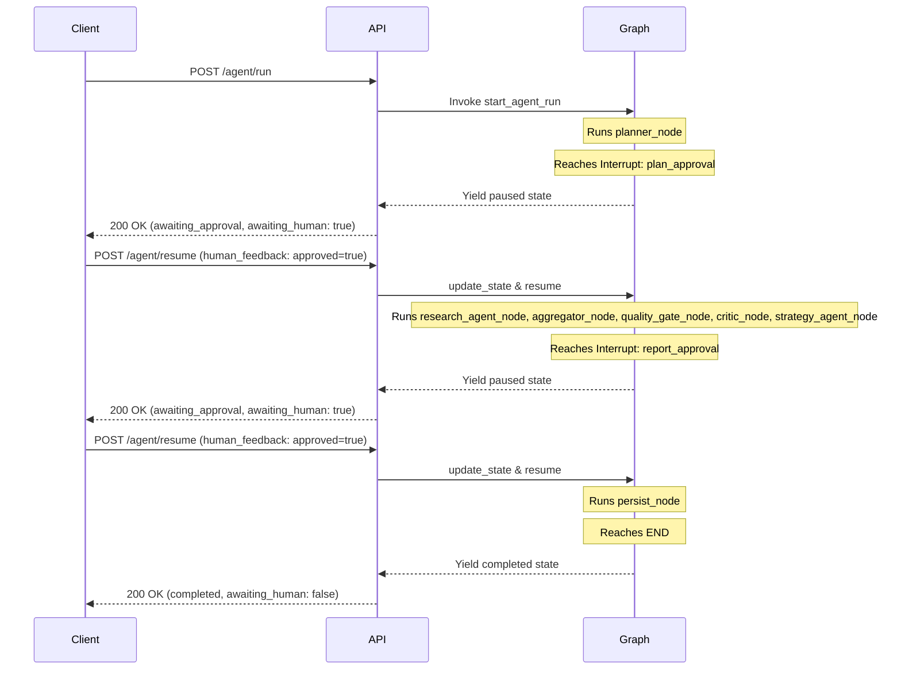

# Stratix API Reference

This document provides a comprehensive reference for all HTTP endpoints exposed by the Stratix backend service. It outlines path structures, authentication details, request/response schemas, and exception-handling behavior.

---

## 1. Overview

* **Base URL**: The default base URL for the Stratix API in local development is `http://localhost:8000`. All endpoint paths described in this document are relative to this root.
* **Authentication Header**: Clients must authenticate requests by including the custom `X-API-Key` HTTP header. This header is optional in development mode if `STRATIX_API_KEY`, `STRATIX_AI_API_KEY`, and `KEYLYTICS_API_KEY` are all unset.
* **Content Type**: All request bodies sent to the API must use the `application/json` content type. All standard API responses are similarly returned in `application/json` format.
* **Validation Errors (422)**: Raised when request payloads do not match the expected Pydantic schemas. The response returns a detailed breakdown of the fields that failed validation.
* **Upstream Errors (502)**: Raised when internal exceptions such as `StratixAPIError` or `StratixDataError` occur, indicating a failure in upstream APIs or data collection. Sensitive API keys in error details are automatically redacted before being returned to the client.
* **Internal Errors (500)**: Raised for unhandled, generic exceptions. The API returns a static error message to avoid exposing raw system internals.

---

## 2. Endpoint Reference

### Health

#### `GET /health`
Verifies API liveness, readiness, SQLite database connectivity, and Gemini API key availability.

**Request:** None

**Response Example (200 OK):**
```json
{
  "status": "ok",
  "db": true,
  "gemini": true
}
```

---

### Keywords

#### `POST /keywords/research`
Discovers related keywords, monthly volumes, CPC, and competition density metrics for a given seed keyword.

**Request Body Example (`KeywordResearchInput`):**
```json
{
  "seed_keyword": "artificial intelligence writing assistant",
  "max_keywords": 5
}
```

**Response Example (200 OK):**
```json
[
  {
    "keyword": "ai writing assistant free",
    "volume": 1200.0,
    "cpc": 1.45,
    "competition": 0.65,
    "data_source": "keylytics_api"
  },
  {
    "keyword": "best ai writing tool",
    "volume": 3600.0,
    "cpc": 2.80,
    "competition": 0.82,
    "data_source": "keylytics_api"
  }
]
```

##### Response Fields (`KeywordSuggestion`)
| Field | Type | Description |
| :--- | :--- | :--- |
| `keyword` | String | The suggested keyword variant. |
| `volume` | Float | Estimated monthly search volume. |
| `cpc` | Float (Optional) | Cost-per-click value in USD. |
| `competition` | Float (Optional) | Competition density index (0.0 to 1.0). |
| `data_source` | String | Data origin source. |

**Notable Status Codes:**
* `422 Unprocessable Entity`: Raised if the request body validation fails (e.g. invalid parameter types).
* `502 Bad Gateway`: Raised if upstream keyword APIs fail or return malformed data.

#### `GET /keywords/history`
Retrieves recent keyword research results stored in the database.

**Request Parameters:**
* `limit` (Query, Optional): Max rows to return (1-500, default: 50).

**Response Example (200 OK):**
```json
[
  {
    "id": 1,
    "seed_keyword": "artificial intelligence writing assistant",
    "keyword": "ai writing assistant free",
    "volume": 1200.0,
    "cpc": 1.45,
    "competition": 0.65,
    "created_at": "2026-06-19T20:53:59"
  }
]
```

**Notable Status Codes:**
* `422 Unprocessable Entity`: Raised if `limit` is out of bounds (less than 1 or greater than 500).

---

### Intelligence

All `/intelligence/*` endpoints are synchronous tool calls wrapped in thread pools to protect the async event loop under load.

#### `POST /intelligence/serp`
* **Legacy Alias**: `POST /intelligence/serp/analyze`
Analyzes search engine results pages (SERP) to identify snippets, PAA questions, competitor rankings, and content gaps.

**Request Body Example (`SerpAnalysisInput`):**
```json
{
  "keyword": "best productivity apps 2026",
  "num_results": 5
}
```

**Response Example (200 OK):**
```json
{
  "keyword": "best productivity apps 2026",
  "serp_data": {
    "organic_results": [
      {
        "title": "Top 10 Productivity Apps for 2026",
        "link": "https://example.com/productivity-apps",
        "snippet": "A comprehensive review of the absolute best productivity apps...",
        "displayed_link": "https://example.com › blog",
        "domain": "example.com",
        "position": 1
      }
    ],
    "people_also_ask": [
      {
        "question": "What is the most popular productivity app?",
        "snippet": "Todoist and Notion remain top choices."
      }
    ],
    "related_searches": [],
    "featured_snippet": {},
    "search_information": {}
  },
  "snippet_analysis": {
    "has_featured_snippet": false,
    "snippet_opportunities": [
      {
        "type": "length",
        "opportunity": "Meta description is too short",
        "recommendation": "Expand the description to 150-160 characters.",
        "priority": "medium"
      }
    ]
  },
  "paa_questions": {
    "questions": [
      {
        "question": "What is the most popular productivity app?",
        "snippet": "Todoist and Notion remain top choices.",
        "content_idea": "Write a comparison article between Todoist and Notion.",
        "opportunity_type": "comparison"
      }
    ],
    "opportunities": []
  },
  "ranking_analysis": {},
  "content_gaps": {},
  "optimization_suggestions": [],
  "summary": "The SERP shows high competition with listicles dominating the top ranks."
}
```

##### Response Fields (`SerpAnalysisResult`)
| Field | Type | Description |
| :--- | :--- | :--- |
| `keyword` | String | The keyword analyzed. |
| `serp_data` | Object | Typed container containing lists of organic results, PAAs, and snippets. |
| `snippet_analysis` | Object | Contains detected featured snippets and overall snippet optimization opportunities. |
| `paa_questions` | Object | Decoded PAA questions and formulated content ideas. |
| `ranking_analysis` | Object | Evaluation of competitor ranking strengths. |
| `content_gaps` | Object | Content formatting and coverage gaps identified in top ranks. |
| `optimization_suggestions`| List | Optimization recommendations modeled as snippet opportunities. |
| `summary` | String | Qualitative textual summary of SERP findings. |

**Notable Status Codes:**
* `422 Unprocessable Entity`: Raised if validation parameters fail.
* `502 Bad Gateway`: Raised if upstream SERP parsing services fail.

#### `POST /intelligence/competitors`
* **Legacy Alias**: `POST /intelligence/competitors/gap`
Identifies keyword opportunities and ranking differences between top competitors for a seed keyword.

**Request Body Example (`CompetitorGapInput`):**
```json
{
  "seed_keyword": "email marketing platform",
  "top_competitors": 3
}
```

**Response Example (200 OK):**
```json
{
  "competitors": [
    {
      "domain": "competitor1.com",
      "rank": 2,
      "title": "Email Marketing & Automation",
      "url": "https://competitor1.com"
    }
  ],
  "opportunities": [
    {
      "keyword": "automated email sequence builder",
      "opportunity_type": "keyword_gap",
      "gap_score": 85.0,
      "traffic_potential": "high",
      "reasoning": "Competitors rank highly for this but your domain has no coverage."
    }
  ],
  "summary": "Significant gaps found in automation-related query terms."
}
```

##### Opportunity Fields (`CompetitorOpportunity`)
| Field | Type | Description |
| :--- | :--- | :--- |
| `keyword` | String | The keyword representing the gap opportunity. |
| `opportunity_type` | String | Category of gap (e.g. `keyword_gap`). |
| `gap_score` | Float | Calculated opportunity gap score (0-100). |
| `traffic_potential` | String | Traffic potential tier (`high`, `medium`, or `low`). |
| `reasoning` | String | Explanatory text for why this opportunity is flagged. |

**Notable Status Codes:**
* `502 Bad Gateway`: Raised if competitor lookup fails.

#### `POST /intelligence/trends`
* **Legacy Alias**: `POST /intelligence/trends/forecast`
Forecasts keyword volume trajectories and analyzes seasonal interest patterns.

**Request Body Example (`TrendForecastInput`):**
```json
{
  "keywords": ["ai copywriting", "seo writing"]
}
```

**Response Example (200 OK):**
```json
{
  "forecasts": {
    "ai copywriting": {
      "forecast_scores": [
        { "month": 1, "score": 75.0, "confidence": 90.0 },
        { "month": 2, "score": 78.0, "confidence": 88.0 }
      ],
      "predicted_growth": 12.5,
      "trend_direction": "strong_growth",
      "recommendation": "Increase content output targeting this term immediately."
    }
  },
  "seasonal_analysis": {
    "ai copywriting": {
      "peak_season": 11,
      "low_season": 12,
      "seasonality_strength": 8.5,
      "growth_rate": 2.4,
      "recommendation": "Prepare campaign for November peak."
    }
  },
  "insights": [
    "ai copywriting: strong upward trajectory over the next quarter"
  ],
  "summary": "Keywords show solid growth prospects heading into the next two quarters."
}
```

##### Forecast Entry Fields (`ForecastEntry`)
| Field | Type | Description |
| :--- | :--- | :--- |
| `forecast_scores` | List | Monthly prediction points containing `month`, `score`, and `confidence`. |
| `predicted_growth` | Float | Predicted growth rate as a percentage. |
| `trend_direction` | String | Direction classification (e.g., `strong_growth`, `stable`). |
| `recommendation` | String | Core optimization suggestion based on trajectory. |

##### Seasonal Entry Fields (`SeasonalAnalysisEntry`)
| Field | Type | Description |
| :--- | :--- | :--- |
| `peak_season` | Integer (Optional) | Month index of peak search interest (1-12). |
| `low_season` | Integer (Optional) | Month index of lowest search interest (1-12). |
| `seasonality_strength` | Float | Standard deviation metric of seasonal factors. |
| `growth_rate` | Float (Optional) | Historical compound growth rate. |
| `recommendation` | String (Optional) | Recommended seasonal content scheduling advice. |

**Notable Status Codes:**
* `502 Bad Gateway`: Raised if forecast extraction fails.

#### `POST /intelligence/clusters`
* **Legacy Alias**: `POST /intelligence/clusters/topic`
Clusters a list of keywords semantically into topic groupings to build content authority.

**Request Body Example (`TopicClusterInput`):**
```json
{
  "keywords": ["ai copywriter", "seo writing tool", "best free ai writer", "automated blogging"]
}
```

**Response Example (200 OK):**
```json
{
  "clusters": [
    {
      "cluster_name": "AI Content Creation",
      "description": "Terms associated with writing copy and blogs autonomously.",
      "keywords": ["ai copywriter", "best free ai writer", "automated blogging"],
      "primary_intent": "commercial",
      "industry_focus": "software",
      "keyword_count": 3,
      "opportunity_score": 78.5,
      "metrics": {
        "avg_volume": 1500.0,
        "avg_competition": 0.72,
        "avg_cpc": 2.10,
        "avg_score": 78.5,
        "total_volume": 4500.0
      }
    }
  ],
  "insights": [
    "AI Content Creation represents the highest combined volume opportunity."
  ],
  "summary": "Clustered keywords into 1 major semantic group."
}
```

##### Cluster Entry Fields (`TopicClusterEntry`)
| Field | Type | Description |
| :--- | :--- | :--- |
| `cluster_name` | String | Named category generated for the cluster. |
| `description` | String | Explanatory description of the semantic scope. |
| `keywords` | List | Keywords belonging to this topic cluster. |
| `primary_intent` | String | Dominant intent tag (e.g. `commercial`). |
| `industry_focus` | String | Primary industry category. |
| `keyword_count` | Integer | Total keywords in the cluster. |
| `opportunity_score`| Float | Combined opportunity score for the cluster. |
| `metrics` | Object | Cluster metrics (averages for volume, CPC, competition). |

**Notable Status Codes:**
* `502 Bad Gateway`: Raised if clustering logic fails.

#### `POST /intelligence/intent`
Classifies the search intent of a keyword.

**Request Body Example (`IntentClassifierInput`):**
```json
{
  "keyword": "buy rank tracking software"
}
```

**Response Example (200 OK):**
```json
{
  "keyword": "buy rank tracking software",
  "intent": "transactional",
  "source": "rule"
}
```

**Notable Status Codes:**
* `502 Bad Gateway`: Raised if Gemini-based classification fails.

---

### Agent

#### `POST /agent/run`
Initializes a stateful multi-agent research run for a seed keyword.

**Request Body Example (`RunRequest`):**
```json
{
  "seed_keyword": "sustainable fashion brands",
  "user_goal": "Identify emerging direct-to-consumer competitors with high organic footprint."
}
```

**Response Example (200 OK):**
```json
{
  "run_id": "8a7b9c6d-5e4f-4a3b-8c2d-1e0f9a8b7c6d",
  "status": "awaiting_approval",
  "awaiting_human": true,
  "checkpoint_data": {
    "research_plan": {
      "seed_keyword": "sustainable fashion brands",
      "objectives": [
        "Identify search volume and trend patterns",
        "Determine key direct-to-consumer competitor domains",
        "Analyze gaps in competitor content visibility"
      ],
      "requested_modules": [
        "keyword_discovery",
        "competitor_gap",
        "topic_clustering"
      ],
      "max_keywords": 20,
      "created_at": "2026-06-19T20:53:59"
    }
  },
  "message": "Research plan generated. Call POST /agent/resume with your approval to start data collection."
}
```

#### `POST /agent/resume`
Resumes a paused research run by submitting feedback or approvals.

**Request Body Example (`ResumeRequest`):**
```json
{
  "run_id": "8a7b9c6d-5e4f-4a3b-8c2d-1e0f9a8b7c6d",
  "human_feedback": {
    "approved": true
  }
}
```

**Response Example (200 OK):**
```json
{
  "run_id": "8a7b9c6d-5e4f-4a3b-8c2d-1e0f9a8b7c6d",
  "status": "awaiting_approval",
  "awaiting_human": true,
  "checkpoint_data": {
    "research_plan": {},
    "strategy_report": {
      "seed_keyword": "sustainable fashion brands",
      "executive_summary": "# Executive Summary\n...",
      "findings": {},
      "top_opportunities": [],
      "recommendations": [],
      "generated_at": "2026-06-19T21:10:00",
      "version": "phase2c"
    },
    "confidence_scores": {
      "keyword_research": 0.95,
      "competitor_gap": 0.88,
      "topic_clustering": 0.90
    },
    "warnings": []
  },
  "message": "Checkpoint reached. Review and call /agent/resume again."
}
```

#### `GET /agent/status/{run_id}`
Retrieves the current execution status and metadata of an agent run.

**Request:** Path parameter `run_id` (String).

**Response Example (200 OK):**
```json
{
  "run_id": "8a7b9c6d-5e4f-4a3b-8c2d-1e0f9a8b7c6d",
  "status": "completed",
  "awaiting_human": false,
  "checkpoint_data": {
    "execution_metadata": {
      "run_id": "8a7b9c6d-5e4f-4a3b-8c2d-1e0f9a8b7c6d",
      "tool_call_counts": {
        "keyword_research": 1,
        "competitor_gap": 1
      }
    },
    "errors": [],
    "confidence_scores": {
      "keyword_research": 0.95,
      "competitor_gap": 0.88
    }
  },
  "message": "Status retrieved successfully."
}
```

**Notable Status Codes:**
* `404 Not Found`: Raised if the requested `run_id` does not exist in checkpoints database.

---

### Monitor

#### `POST /monitor/add`
Schedules a recurring research job for a seed keyword to run in auto-approve mode.

**Request Body Example (`AddMonitoringJobRequest`):**
```json
{
  "seed_keyword": "organic coffee beans",
  "interval_hours": 24
}
```

**Response Example (200 OK):**
```json
{
  "job_id": "monitor_job_organic_coffee_beans",
  "seed_keyword": "organic coffee beans",
  "interval_hours": 24,
  "message": "Monitoring job 'monitor_job_organic_coffee_beans' created. Will run every 24h for 'organic coffee beans'."
}
```

**Notable Status Codes:**
* `503 Service Unavailable`: Raised if the background monitoring scheduler is not active.
* `422 Unprocessable Entity`: Raised if `interval_hours` falls outside the allowed 1-168 range.

#### `DELETE /monitor/{job_id}`
Removes an active scheduled monitoring job.

**Request:** Path parameter `job_id` (String).

**Response Example (200 OK):**
```json
{
  "removed": true,
  "job_id": "monitor_job_organic_coffee_beans"
}
```

**Notable Status Codes:**
* `503 Service Unavailable`: Raised if scheduler is not running.
* `404 Not Found`: Raised if the target `job_id` does not exist.

#### `GET /monitor/jobs`
Lists all active scheduled keyword monitoring jobs.

**Request:** None

**Response Example (200 OK):**
```json
[
  {
    "job_id": "monitor_job_organic_coffee_beans",
    "seed_keyword": "organic coffee beans",
    "interval_hours": 24,
    "last_run": "2026-06-19T20:00:00",
    "next_run": "2026-06-20T20:00:00",
    "status": "active"
  }
]
```

#### `GET /monitor/history/{seed_keyword}`
Retrieves the execution history of the last 10 research runs for a keyword.

**Request:** Path parameter `seed_keyword` (String).

**Response Example (200 OK):**
```json
[
  {
    "run_id": "8a7b9c6d-5e4f-4a3b-8c2d-1e0f9a8b7c6d",
    "seed_keyword": "organic coffee beans",
    "triggered_by": "scheduler",
    "status": "completed",
    "started_at": "2026-06-19T20:00:00",
    "completed_at": "2026-06-19T20:15:00",
    "has_report": true
  }
]
```

#### `GET /monitor/diff/{seed_keyword}`
Fetches the latest computed report diff comparing the last two completed runs for a keyword.

**Request:** Path parameter `seed_keyword` (String).

**Response Example (200 OK):**
```json
{
  "seed_keyword": "organic coffee beans",
  "generated_at": "2026-06-19T20:15:00",
  "keyword_deltas": [
    {
      "keyword": "organic medium roast coffee",
      "prev_score": 65.0,
      "curr_score": 72.0,
      "delta": 7.0,
      "direction": "improved"
    }
  ],
  "new_recommendations": ["Focus content on fair-trade origins."],
  "dropped_recommendations": [],
  "confidence_delta": {
    "keyword_research": 0.02
  },
  "summary": "Keyword opportunities improved slightly due to volume increase."
}
```

##### Report Diff Fields (`ReportDiff`)
| Field | Type | Description |
| :--- | :--- | :--- |
| `seed_keyword` | String | The monitored seed keyword. |
| `generated_at` | String | Timestamp when the diff was calculated. |
| `keyword_deltas` | List | Opportunity score deltas for related keywords. |
| `new_recommendations`| List | Actionable recommendations introduced in the current report. |
| `dropped_recommendations` | List | Actionable recommendations removed from the current report. |
| `confidence_delta` | Dict | Changes in confidence scores per tool. |
| `summary` | String | Short, human-readable summary of the diff. |

**Notable Status Codes:**
* `404 Not Found`: Raised if fewer than 2 completed runs are found for the keyword.

---

### Evals

#### `GET /evals/{run_id}`
Retrieves all LLM-as-judge evaluation scores and rationales for a specific research run.

**Request:** Path parameter `run_id` (String).

**Response Example (200 OK):**
```json
[
  {
    "run_id": "8a7b9c6d-5e4f-4a3b-8c2d-1e0f9a8b7c6d",
    "eval_type": "plan_quality",
    "score": 0.9,
    "rationale": "The generated plan covers all requested topics and has high search relevance.",
    "dimension_scores": {
      "coverage": 0.9,
      "relevance": 0.9
    },
    "evaluated_at": "2026-06-19T20:53:59"
  }
]
```

##### Eval Result Fields (`EvalResult`)
| Field | Type | Description |
| :--- | :--- | :--- |
| `run_id` | String | Research run ID this evaluation belongs to. |
| `eval_type` | String | Aspect evaluated (`plan_quality`, `report_quality`, or `tool_reliability`). |
| `score` | Float | Normalized score (0.0 to 1.0). |
| `rationale` | String | Qualitative LLM explanation of the score. |
| `dimension_scores`| Dict | Finer, dimension-by-dimension scores. |
| `evaluated_at` | String | Timestamp when evaluation was executed. |

**Notable Status Codes:**
* `404 Not Found`: Raised if no evaluations are found for the given `run_id`.

#### `GET /evals/trends/{seed_keyword}`
Retrieves evaluation score trends over the last 10 completed runs for a keyword.

**Request:** Path parameter `seed_keyword` (String).

**Response Example (200 OK):**
```json
[
  {
    "run_id": "8a7b9c6d-5e4f-4a3b-8c2d-1e0f9a8b7c6d",
    "evaluated_at": "2026-06-19T20:15:00",
    "plan_score": 0.9,
    "report_score": 0.85,
    "tool_score": 0.95
  }
]
```

**Notable Status Codes:**
* `404 Not Found`: Raised if no completed runs are found for the keyword.

---

### Observability

#### `GET /metrics`
Exposes Prometheus-compatible metrics for API latencies, token consumption, and system health.

**Request:** None

**Response Example (200 OK - Plain Text):**
```text
# HELP keylytics_api_request_duration_seconds HTTP request latency in seconds
# TYPE keylytics_api_request_duration_seconds histogram
keylytics_api_request_duration_seconds_bucket{le="0.1"} 12
keylytics_api_request_duration_seconds_sum 1.45
keylytics_api_request_duration_seconds_count 15
```

#### `GET /health/detailed`
Exposes extended component health status alongside score averages and database statistics.

**Request:** None

**Response Example (200 OK):**
```json
{
  "status": "ok",
  "components": {
    "database": "ok",
    "gemini_api": "ok",
    "langgraph": "ok"
  },
  "eval_scores": {
    "plan_quality": 0.91,
    "report_quality": 0.88,
    "tool_reliability": 0.94
  },
  "monitoring": {
    "active_jobs": 3
  },
  "database": {
    "keywords": 125,
    "eval_results": 45,
    "monitoring_jobs": 3
  },
  "metrics_summary": {}
}
```

---

### Timeline

#### `GET /timeline/{run_id}`
Reconstructs the execution timeline of an agent run from the LangGraph checkpoint history.

**Request:** Path parameter `run_id` (String).

**Response Example (200 OK):**
```json
{
  "run_id": "8a7b9c6d-5e4f-4a3b-8c2d-1e0f9a8b7c6d",
  "seed_keyword": "sustainable fashion brands",
  "status": "completed",
  "total_duration_ms": 15200.0,
  "events": [
    {
      "event_type": "node_start",
      "node_name": "planner_node",
      "timestamp": "2026-06-19T20:53:59Z",
      "duration_ms": null,
      "metadata": {}
    },
    {
      "event_type": "hitl_interrupt",
      "node_name": "HITL1",
      "timestamp": "2026-06-19T20:54:02Z",
      "duration_ms": null,
      "metadata": {
        "checkpoint": "plan_approval"
      }
    }
  ],
  "confidence_scores": {
    "keyword_research": 0.95
  },
  "critic_verdict": "PASS",
  "eval_scores": {
    "plan_quality": 0.9
  }
}
```

##### Timeline Fields (`ExecutionTimeline`)
| Field | Type | Description |
| :--- | :--- | :--- |
| `run_id` | String | Unique identifier of the run. |
| `seed_keyword` | String | Seed keyword analyzed during the run. |
| `status` | String | Progress status of the run (`completed`, `failed`, `in_progress`, etc.). |
| `total_duration_ms` | Float (Optional)| Total time in milliseconds elapsed during the run. |
| `events` | List | Timeline event structures detailing step progressions. |
| `confidence_scores` | Dict | Final calculated confidence scores. |
| `critic_verdict` | String (Optional)| Feedback outcome issued by the Adversarial Critic. |
| `eval_scores` | Dict | Evaluation scores mapped by evaluation dimensions. |

**Notable Status Codes:**
* `404 Not Found`: Raised if the run checkpoint history is not found.

---

## 3. Authentication

The Stratix API uses the custom HTTP header `X-API-Key` to authorize incoming requests.

```http
X-API-Key: your_stratix_api_key_here
```

### Route-Level Enforcement
* **Enforced Routers**: All endpoints nested under the `/keywords`, `/intelligence`, `/agent`, `/monitor`, `/evals`, and `/timeline` paths require valid credentials.
* **Excluded Routers**: The liveness health checks (`/health`) and observability metrics endpoints (`/metrics`, `/health/detailed`) are publicly accessible and do not require the header.

### Development Mode Bypass
If the server environment variables `STRATIX_API_KEY`, `STRATIX_AI_API_KEY`, and `KEYLYTICS_API_KEY` are all empty or unset, authentication checks are skipped. In this configuration, the API functions in **dev-mode**, accepting any value (or no header at all) for the `X-API-Key` header.

---

## 4. The Agent Run Lifecycle

The `/agent/run` and `/agent/resume` endpoints coordinate long-running stateful pipelines that pause for human approval. The lifecycle of a run threads a single `run_id` through multiple states:



### Step-by-Step Transition Walkthrough

#### Step 1: Initializing the Run
A client initiates a new workflow for a seed keyword:
* **Request**: `POST /agent/run` with keyword `"sustainable fashion brands"`.
* **Behavior**: The graph builds the initial state, runs the `planner_node` to construct the outline, and triggers a compile-time interrupt at the `plan_approval` boundary.
* **State Values**:
  * `status`: `"awaiting_approval"`
  * `awaiting_human`: `true`
  * `checkpoint_data`: Contains `"research_plan"` for inspection.

#### Step 2: Approving the Plan
The client reviews and resumes execution:
* **Request**: `POST /agent/resume` with `run_id` and payload `{"human_feedback": {"approved": true}}`.
* **Behavior**: The graph updates the feedback state, resets `awaiting_human` to `false`, and resumes execution. It runs through data collection (`research_agent_node`), metrics normalization (`aggregator_node`), quantitative filtering (`quality_gate_node`), adversarial feedback review (`critic_node`), and final report composition (`strategy_agent_node`). It then pauses at the second compile-time interrupt: `report_approval`.
* **State Values**:
  * `status`: `"awaiting_approval"`
  * `awaiting_human`: `true`
  * `checkpoint_data`: Contains `"research_plan"`, `"strategy_report"`, and `"confidence_scores"`.

#### Step 3: Approving the Strategy Report
The client approves the final strategic findings:
* **Request**: `POST /agent/resume` with `run_id` and payload `{"human_feedback": {"approved": true}}`.
* **Behavior**: The graph resumes, runs the `persist_node` to save records to the database, and transitions to the `END` state.
* **State Values**:
  * `status`: `"completed"`
  * `awaiting_human`: `false`
  * `checkpoint_data`: `null` (the client is notified that the report has been successfully archived).

---

## 5. Tool Registry Endpoints

The `/intelligence/*` endpoints map directly to individual tools registered in the platform's central registry ([registry.py](../src/tools/registry.py)):

* `POST /intelligence/serp` $\rightarrow$ `serp_analysis`
* `POST /intelligence/competitors` $\rightarrow$ `competitor_gap`
* `POST /intelligence/trends` $\rightarrow$ `trend_forecast`
* `POST /intelligence/clusters` $\rightarrow$ `topic_cluster`
* `POST /intelligence/intent` $\rightarrow$ `intent_classifier`
* `POST /keywords/research` $\rightarrow$ `keyword_research`

### Graph Execution vs. Direct REST Access
These endpoints expose individual tool capabilities directly to clients for one-off research tasks. During full agent execution runs, the orchestrating LangGraph pipeline accesses these exact same tools internally. 

Instead of routing requests over HTTP, the graph utilizes the `invoke_tool()` helper framework. This wrapper acts as an exception-eating dispatch mechanism: network timeouts or parsing exceptions are converted into structured errors (`{"error": ..., "tool": ...}`) and written directly back into the graph's execution state rather than crashing the orchestrator thread.

For more details on how these registry nodes are wired together inside the multi-agent graph, see [ARCHITECTURE.md](./ARCHITECTURE.md).
