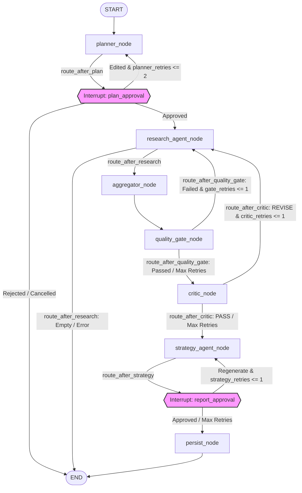

# Stratix Architecture Deep Dive

This document details the engineering specifications, state graphs, node contracts, and data quality rubrics underlying the Stratix multi-agent research pipeline.

---

## 1. Graph Topology

The Stratix execution pipeline is built as a stateful LangGraph `StateGraph`. The graph coordinates sequential execution, human-in-the-loop checkpoints, deterministic filtering gates, and LLM-as-judge evaluations.



### Cyclical Routing & Retries
The pipeline implements two operational retry loops designed to resolve execution issues dynamically:
1. **Research Rectification Cycle**: Triggers when the deterministic `quality_gate_node` fails or when the adversarial `critic_node` returns a `REVISE` verdict. If retry budgets allow, execution flows back to `research_agent_node` to gather additional or cleaner data.
2. **Strategy Refinement Cycle**: Pauses at the `report_approval` interrupt. If a human operator requests modifications, the graph routes back to `strategy_agent_node` to regenerate the report incorporating operator notes.

### Retry Budgets
Retry limits are strictly checked inside routing helpers to prevent infinite execution loops:
* **Planner Retries (`planner_retries`)**: $\le 2$ loops. Controlled in `route_after_plan`.
* **Gate Retries (`gate_retries`)**: $\le 1$ loop. Controlled in `route_after_quality_gate`.
* **Critic Retries (`critic_retries`)**: $\le 1$ loop. Controlled in `route_after_critic`.
* **Strategy Retries (`strategy_retries`)**: $\le 1$ loop. Controlled in `route_after_strategy`.

---

## 2. Node Contracts

### `planner_node`
* **Node Type**: LLM-Based Structured Generator.
* **Inputs Read**: `seed_keyword` (str), `human_feedback` (dict|None), `execution_metadata` (dict).
* **Outputs Written**: `research_plan` (dict), `status` (`"awaiting_approval"`), `awaiting_human` (`true`), `execution_metadata` (dict), `messages` (list).
* **Interrupts**: Yes. Calls the `interrupt()` function containing `research_plan` details.
* **Failure Behavior**: On LLM or parsing errors, it logs the exception, falls back to a default `ResearchPlan` (containing `keyword_discovery`, `competitor_gap`, and `serp_analysis` modules, with `max_keywords=10`), and pauses at the interrupt.

### `research_agent_node`
* **Node Type**: ReAct Agent (built using `create_react_agent`).
* **Inputs Read**: `research_plan` (dict), `messages` (list), `execution_metadata` (dict), `errors` (list).
* **Outputs Written**: `collected_data` (dict), `status` (`"in_progress"` or `"failed"`), `awaiting_human` (`false`), `human_feedback` (`None`), `messages` (list), `execution_metadata` (dict), `errors` (list).
* **Interrupts**: No.
* **Failure Behavior**: On exception, it appends the error trace to the `errors` list, updates the status to `"failed"`, and returns the current state.

### `aggregator_node`
* **Node Type**: Deterministic Python Function.
* **Inputs Read**: `collected_data` (dict), `research_plan` (dict), `seed_keyword` (str), `errors` (list).
* **Outputs Written**: `intelligence_findings` (dict), `confidence_scores` (dict), `errors` (list), `status` (`"in_progress"`), `human_feedback` (`None`).
* **Interrupts**: No.
* **Failure Behavior**: Ignores individual malformed records, appends warnings to `errors`, and writes empty data placeholders for missing tools to let subsequent steps proceed.

### `quality_gate_node`
* **Node Type**: Deterministic Python Function.
* **Inputs Read**: `confidence_scores` (dict), `intelligence_findings` (dict), `execution_metadata` (dict), `errors` (list).
* **Outputs Written**: `execution_metadata` (dict, appends `data_quality_summary`), `errors` (list, appends limitations if gate fails), `human_feedback` (`None`).
* **Interrupts**: No.
* **Failure Behavior**: Accumulates quality warnings as strings in `errors`.

### `critic_node`
* **Node Type**: LLM-Based Adversarial Critic.
* **Inputs Read**: `intelligence_findings` (dict), `confidence_scores` (dict), `execution_metadata` (dict), `errors` (list).
* **Outputs Written**: `critic_feedback` (dict), `execution_metadata` (dict), `human_feedback` (`None`).
* **Interrupts**: No.
* **Failure Behavior**: Logs the exception and falls back to a default `PASS` verdict with a neutral `critic_score` of `0.5` to avoid blocking pipeline progression.

### `strategy_agent_node`
* **Node Type**: LLM-Based Structured Generator.
* **Inputs Read**: `intelligence_findings` (dict), `confidence_scores` (dict), `research_plan` (dict), `human_feedback` (dict|None), `execution_metadata` (dict), `errors` (list), `critic_feedback` (dict).
* **Outputs Written**: `strategy_report` (dict), `status` (`"awaiting_approval"`), `awaiting_human` (`true`), `execution_metadata` (dict), `errors` (list), `messages` (list).
* **Interrupts**: Yes. Calls the `interrupt()` function containing `strategy_report`, `confidence_scores`, and `warnings`.
* **Failure Behavior**: Logs parsing errors, falls back to a default strategy draft, and proceeds to pause at the interrupt boundary.

### `persist_node`
* **Node Type**: Deterministic Python Function.
* **Inputs Read**: `intelligence_findings` (dict), `execution_metadata` (dict), `errors` (list), `research_plan` (dict), `strategy_report` (dict), `confidence_scores` (dict), `collected_data` (dict).
* **Outputs Written**: `status` (`"completed"`), `awaiting_human` (`false`), `human_feedback` (`None`), `execution_metadata` (dict), `errors` (list).
* **Interrupts**: No.
* **Failure Behavior**: Catches SQL errors, appends them to `errors`, and marks execution status as `"completed"` (with errors).

---

## 3. State Schema (`AgentState`)

The state schema is defined in [state.py](file:///c:/Users/Shafia/PROJECTS/Stratix/src/graph/state.py) as a `TypedDict`. Individual fields are marked as optional so that executing nodes can update slices of the state independently.

| Field Name | Type | Initializing Node | Downstream Reading Nodes |
| :--- | :--- | :--- | :--- |
| `seed_keyword` | `str` | Entry point config | `planner_node`, `aggregator_node` |
| `research_plan` | `Optional[Dict[str, Any]]` | `planner_node` | `research_agent_node`, `aggregator_node`, `strategy_agent_node`, `persist_node` |
| `collected_data` | `Optional[Dict[str, Any]]` | `research_agent_node` | `aggregator_node`, `persist_node` (evals) |
| `intelligence_findings`| `Optional[Dict[str, Any]]`| `aggregator_node` | `critic_node`, `strategy_agent_node`, `persist_node` |
| `confidence_scores` | `Optional[Dict[str, float]]` | `aggregator_node` | `quality_gate_node`, `critic_node`, `strategy_agent_node`, `persist_node` (evals) |
| `strategy_report` | `Optional[Dict[str, Any]]` | `strategy_agent_node` | `persist_node`, `route_after_strategy` |
| `human_feedback` | `Optional[Dict[str, Any]]` | External Client | `planner_node`, `strategy_agent_node`, routing helpers |
| `awaiting_human` | `bool` | `planner_node` | Shared across checkpoints |
| `messages` | `Annotated[List[Any], add_messages]` | `planner_node` | `research_agent_node`, `strategy_agent_node` |
| `execution_metadata` | `Optional[Dict[str, Any]]` | Entry point config | Read/updated by all nodes |
| `status` | `str` | Entry point config | Read/updated by all nodes |
| `critic_feedback` | `Optional[Dict[str, Any]]` | `critic_node` | `route_after_critic`, `strategy_agent_node`, `persist_node` |
| `critic_retries` | `int` | `critic_node` | `route_after_critic` |
| `errors` | `List[str]` | `research_agent_node` | `aggregator_node`, `strategy_agent_node`, `persist_node` |

### Message Accumulation Reducer
The `messages` field is decorated with the `add_messages` reducer. LangGraph uses this reducer to accumulate messages within the thread. Instead of replacing the list on every node write, `add_messages` appends new messages or updates existing ones matching unique IDs. This maintains the complete message history across agent iterations.

---

## 4. Confidence Scoring Rubrics

Confidence scores are calculated deterministically inside the `aggregator_node` using metric signals gathered during tool execution.

| Tool Name | Confidence Formula | Score Bands & Meaning |
| :--- | :--- | :--- |
| **`keyword_research`** | `fill_ratio = count / requested`<br>If $fill\_ratio \ge 1.0$: `1.0` if `avg_volume > 0` else `0.7`<br>Else: `fill_ratio * (1.0` or `0.7)` | **`1.0`**: Requested keyword count met with valid search volumes.<br>**`0.7`**: Count met but volumes are zero (Gemini fallback mode).<br>**`0.0 - 0.99`**: Count is below the requested threshold (scaled linearly). |
| **`serp_analysis`** | Evaluates list counts of `organic_results` and `people_also_ask` (PAA). | **`1.0`**: Organic results $\ge 5$ AND PAA questions $\ge 2$.<br>**`0.6`**: Organic results $\ge 3$ (PAA questions missing).<br>**`0.2`**: Underperforming data (Organic results $< 3$).<br>**`0.0`**: Tool failed or was skipped. |
| **`competitor_gap`** | Evaluates opportunity counts and the maximum competitor gap score found. | **`1.0`**: Opportunities found $\ge 3$ AND at least one gap score $> 70$.<br>**`0.5`**: Opportunities found $\ge 1$.<br>**`0.0`**: Tool failed or found zero opportunities. |
| **`trend_forecast`** | Ratio of keywords returning forecasts with statistical fit: $r\_squared > 0.3$. | **`0.0 - 1.0`**: Linear ratio representing the proportion of keywords with reliable forecasting curves. |
| **`topic_cluster`** | Evaluates total cluster count and the average keyword count per cluster. | **`1.0`**: Clusters $\ge 3$ AND average keywords per cluster $\ge 3$.<br>**`0.5`**: Clusters $\ge 2$.<br>**`0.2`**: Only 1 cluster formed.<br>**`0.0`**: Tool failed or found zero clusters. |

---

## 5. Quality Gate vs. Critic Node: Division of Responsibility

Stratix routes intelligence findings through two separate quality filters to isolate quantitative check failures from qualitative content issues:

```
                  ┌────────────────────────────────────┐
                  │        Intelligence Findings       │
                  └─────────────────┬──────────────────┘
                                    │
                                    ▼
       ===========================================================
       Deterministical: Enforces volume signals and result counts
       ===========================================================
       [ quality_gate_node ] ─────────────────────────► Fails?
               │                                            │ (retries <= 1)
               │ Pass / Max Retries                         ▼
               ▼                                  [ Loop Back to Research ]
       ===========================================================
       Qualitative: Audits logical claims and data consistency
       ===========================================================
       [ critic_node ] ───────────────────────────────► Fails?
               │                                            │ (retries <= 1)
               │ Pass / Max Retries                         ▼
               ▼                                  [ Loop Back to Research ]
       [ strategy_agent_node ]
```

### 1. Deterministic Quality Gate (`quality_gate_node`)
* **Role**: Evaluates quantitative metrics before allocating LLM compute resources.
* **Criteria**: Verifies `keyword_research` confidence $\ge 0.3$ and total keywords $\ge 3$.
* **Routing**: Fails fast. If the criteria are not met and `gate_retries` $\le 1$, it immediately routes execution back to the `research_agent_node` to gather better data.

### 2. Qualitative Critic Node (`critic_node`)
* **Role**: Runs an LLM audit to evaluate semantic quality, claim consistency, and logical gaps.
* **Criteria**: Inspects issues like weak assertions, data gaps (e.g., using low-confidence tool data as if it were reliable), and structural formatting.
* **Routing**: If the critic issues a `REVISE` verdict and `critic_retries` $\le 1$, the router redirects execution back to `research_agent_node`.

### Rationale for Separation
By separating these checks, Stratix avoids sending empty or low-density data to the LLM critic, saving API token costs. The deterministic gate guarantees a baseline data density, allowing the critic to focus solely on high-level analysis and claim validation.

---

## 6. Tool Invocation Inside the Graph

Stratix uses a unified registry ([registry.py](file:///c:/Users/Shafia/PROJECTS/Stratix/src/tools/registry.py)) to map and execute tools. However, the graph and the REST API use two distinct invocation pathways:

```
                            ┌─────────────────────┐
                            │    TOOL_REGISTRY    │
                            └────┬───────────┬────┘
                                 │           │
           ┌─────────────────────┘           └─────────────────────┐
           │                                                       │
           ▼ (Graph Path)                                          ▼ (Direct REST Path)
   [ get_langchain_tools() ]                                 [ route handler ]
           │                                                       │
           ▼ (StructuredTool wraps)                                ▼ (Direct fn Execution)
   [ research_agent_node ]                                   [ spec.fn(validated_input) ]
           │                                                       │
           ▼ (create_react_agent)                                  ▼ (FastAPI Middleware)
   [ ReAct Agent Loop ]                                      [ Raises exceptions to client ]
           │
           ▼ (invoke_tool exception-eating wrapper)
   [ Returns {"error": ...} into Graph State ]
```

### Graph Execution Path
The `research_agent_node` calls `get_langchain_tools()`, which wraps each tool in a LangChain `StructuredTool` adapter. These adapters are passed to a ReAct agent loop (`create_react_agent`). 

When a tool executes, it runs through the `invoke_tool()` exception-eating wrapper. If an API call fails or validation fails, `invoke_tool()` returns a structured dictionary (e.g. `{"error": "Timeout", "tool": "competitor_gap"}`) instead of raising an exception. This allows the ReAct agent to record the failure in the message history and continue execution without crashing the graph runtime.

### Direct REST Access Path
REST routes (e.g., `POST /intelligence/serp`) bypass the LangChain wrapper. They load the tool directly from `TOOL_REGISTRY` and call `spec.fn(validated_input)` in a separate thread. If the tool fails, it raises an exception (e.g., `StratixAPIError`) which is handled by FastAPI's global exception handlers and returned to the client as an HTTP error response (e.g., 502 Bad Gateway).

---

## 7. Checkpointing

State persistence in Stratix is managed by LangGraph's `SqliteSaver` checkpointer.

### Database Schema
The checkpointer writes checkpoints to the SQLite database specified by `STRATIX_DB_PATH` (defaulting to `keylytics.db`). It creates and manages several internal tables:
* `checkpoints`: Stores serialized copies of the `AgentState` TypedDict, including the message history and metadata.
* `writes`: Tracks intermediate channel writes occurring within node executions.
* `checkpoint_blobs`: Holds binary serialization payloads.

### Timeline Reconstruction
The timeline endpoint (`GET /timeline/{run_id}`) reconstructs the execution history of a run using the checkpointer. It calls `graph.get_state_history(config)` to load all historical state checkpoints in reverse chronological order. 

By comparing state changes across these checkpoints, the endpoint identifies step boundaries:
* **Node Start**: Detected when a node transitions in the checkpoint history.
* **Interrupts**: Detected when `awaiting_human` is flagged as `true` in a checkpoint.
* **Errors**: Extracted from the accumulated messages in the `errors` list.
* **Tool Execution**: Reconstructed from tool call logs stored in `execution_metadata`.
